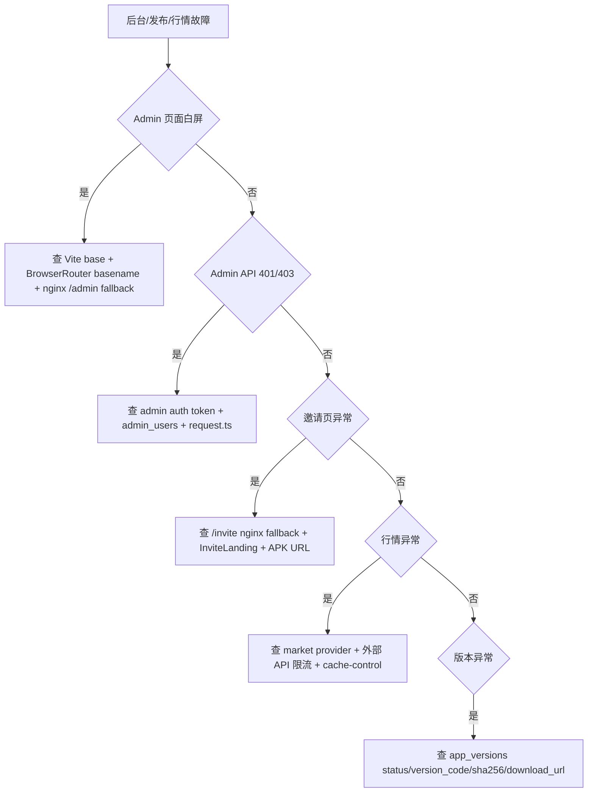

# Admin / Market / Release 维护 Runbook

最后更新: 2026-04-26

适用范围: Admin Web、后台 API、套餐/节点/订单/提现管理、行情接口、App 版本发布、法务文档、系统配置、静态资源部署。

## 第 1 层: 模块定位

### 改哪里

- Admin Web: `code/admin-web/src/`
- Admin Web API 封装: `code/admin-web/src/api/`
- Admin 页面: `code/admin-web/src/pages/`
- Admin backend: `code/backend/src/modules/admin/`
- Market backend: `code/backend/src/modules/market/`
- App version backend: `code/backend/src/modules/app-versions/`, `code/backend/src/modules/admin/versions/`
- Legal docs backend: `code/backend/src/modules/admin/legal/`
- 部署文档: `code/deploy/ADMIN_WEB_DEPLOYMENT.md`, `code/deploy/BACKEND_DEPLOYMENT.md`

### 联动哪里

- Admin Web 调 `/api/admin/v1/*`。
- Admin Web `/invite` 是公开落地页，不能套后台鉴权。
- App 下载 URL 与 Android APK 发布和 `app_versions` 表联动。
- Market API 供 Android 行情/资产页使用。

### 验证什么

```bash
npm --prefix code/admin-web run build
pnpm --dir code/backend test:e2e -- admin-postgres.e2e-spec.ts market.e2e-spec.ts
curl -I https://api.residential-agent.com/admin/
curl "https://api.residential-agent.com/api/client/v1/market/overview"
curl "https://api.residential-agent.com/api/client/v1/app-versions/latest?platform=android&channel=official"
```

### 常见坑

- Admin Web 线上挂在 `/admin/`，Vite `base` 和 React Router `basename` 必须匹配。
- `/invite` 和 `/admin/*` 都回退到同一个 `index.html`，但 `/invite` 不走后台登录。
- `VITE_PUBLIC_ANDROID_APK_URL` 没注入时下载按钮会不可用。
- Market 接口目前以 CoinGecko provider 为主，注意外部限流和缓存。

## 第 2 层: 业务模块章节

| 能力 | 主要文件 | 验证 |
| --- | --- | --- |
| 后台登录 | `admin/auth/admin-auth.controller.ts`, `Login.tsx` | `POST /admin/v1/auth/login` |
| Dashboard | `admin/dashboard/`, `Dashboard.tsx` | `GET /admin/v1/dashboard/summary` |
| 套餐管理 | `admin/plans/`, `Plans.tsx` | `GET/POST/PUT /admin/v1/plans` |
| 区域/节点 | `admin/vpn/`, `Regions.tsx`, `Nodes.tsx` | `GET /admin/v1/vpn/regions`, `/nodes` |
| 订单管理 | `admin/orders/`, `Orders.tsx` | `GET /admin/v1/orders` |
| 提现管理 | `admin/withdrawals/`, `Withdrawals.tsx` | `GET /admin/v1/withdrawals` |
| 版本管理 | `admin/versions/`, `Versions.tsx`, `app-versions/` | `GET /client/v1/app-versions/latest` |
| 法务文档 | `admin/legal/`, `LegalDocs.tsx` | `GET /admin/v1/legal-documents` |
| 行情 | `market/`, Android market pages | `GET /client/v1/market/*` |

## 第 3 层: 接口 / 数据层

### 具体接口清单

Admin:

- `POST /api/admin/v1/auth/login`
- `GET /api/admin/v1/dashboard/summary`
- `GET /api/admin/v1/accounts`
- `GET /api/admin/v1/accounts/:accountId`
- `GET /api/admin/v1/orders`
- `GET /api/admin/v1/orders/:orderNo`
- `GET /api/admin/v1/withdrawals`
- `GET /api/admin/v1/plans`
- `POST /api/admin/v1/plans`
- `PUT /api/admin/v1/plans/:planId`
- `GET /api/admin/v1/vpn/regions`
- `GET /api/admin/v1/vpn/nodes`
- `GET /api/admin/v1/system-configs`
- `GET /api/admin/v1/app-versions`
- `GET /api/admin/v1/legal-documents`
- `GET /api/admin/v1/audit-logs`

Client release/market:

- `GET /api/client/v1/app-versions/latest`
- `GET /api/client/v1/market/overview`
- `GET /api/client/v1/market/search`
- `GET /api/client/v1/market/spotlights`
- `GET /api/client/v1/market/favorites`
- `GET /api/client/v1/market/rankings`
- `GET /api/client/v1/market/instruments/:instrumentId`
- `GET /api/client/v1/market/instruments/:instrumentId/candles`

### 关键表清单

- `admin_users`
- `audit_logs`
- `plans`
- `vpn_regions`
- `vpn_nodes`
- `orders`
- `commission_withdraw_requests`
- `app_versions`
- `legal_documents`
- `system_configs`

Market 当前主要是外部 provider + runtime config，baseline SQL 无独立行情表。

### 发布前检查项

- Admin Web `npm run build` 通过。
- 构建时注入正确 `VITE_PUBLIC_ANDROID_APK_URL`。
- `/admin/` 刷新任意路由不白屏。
- `/invite?code=` 返回邀请页而不是后台登录页。
- backend Admin API 与前端字段一致。
- `app_versions.download_url`、`sha256`、`version_code` 与 APK 一致。

## 第 4 层: 源码 / SQL / 排障层

### 关键类 / 关键脚本清单

- `code/admin-web/src/App.tsx`
- `code/admin-web/src/api/request.ts`
- `code/admin-web/src/pages/Plans.tsx`
- `code/admin-web/src/pages/InviteLanding.tsx`
- `code/backend/src/modules/admin/admin.module.ts`
- `code/backend/src/modules/admin/plans/admin-plans.service.ts`
- `code/backend/src/modules/admin/versions/admin-versions.service.ts`
- `code/backend/src/modules/market/market.provider.ts`
- `code/deploy/ADMIN_WEB_DEPLOYMENT.md`
- `code/deploy/BACKEND_DEPLOYMENT.md`

### 常用 SQL 文件清单

- `code/backend/migrations/baseline/0001_init.up.sql`
- `code/backend/migrations/seeds/0001_bootstrap_seed.sql`
- `docs/MARKET_REAL_API_REQUIREMENTS.md`
- `docs/LIAOJIANG_MARKET_API_GAP_ANALYSIS.md`
- `docs/RCB27_APP_MARKET_ROUTE_AUDIT.md`
- `docs/CLOUDFLARE_CDN_AUDIT_2026-04-23.md`

### 故障排查顺序图



## 第 5 层: 修复 / 风险 / 回滚层

### 常见数据修复模板

修 App 版本发布记录:

```sql
BEGIN;
CREATE TABLE ops_backup_app_versions_<yyyymmdd> AS
SELECT * FROM app_versions WHERE platform = 'android' AND channel = '<channel>';

SELECT id, version_name, version_code, status, force_update, download_url, sha256
FROM app_versions
WHERE platform = 'android' AND channel = '<channel>'
ORDER BY version_code DESC;

-- 示例: 撤回错误版本。
UPDATE app_versions
SET status = 'DEPRECATED', updated_at = now()
WHERE id = '<bad-version-id>' AND status = 'PUBLISHED';

-- 示例: 发布已校验版本。sha256 必须来自实际 APK。
UPDATE app_versions
SET status = 'PUBLISHED', published_at = COALESCE(published_at, now()), updated_at = now()
WHERE id = '<good-version-id>' AND status IN ('DRAFT','DEPRECATED');

ROLLBACK;
```

修后台用户状态:

```sql
BEGIN;
CREATE TABLE ops_backup_admin_users_<yyyymmdd> AS
SELECT * FROM admin_users WHERE username = '<username>';

SELECT id, username, role, status, last_login_at FROM admin_users WHERE username = '<username>';

UPDATE admin_users
SET status = 'ACTIVE', updated_at = now()
WHERE username = '<username>' AND status = 'DISABLED';

ROLLBACK;
```

### 线上操作禁忌

- 禁止把 `/invite` 配到后台鉴权路由。
- 禁止用测试 APK 更新 `app_versions` 正式渠道。
- 禁止跳过 `nginx -t` reload nginx。
- 禁止把 admin token、密码、Cloudflare key 写入前端环境。
- 禁止因行情失败阻断钱包基础资产页，应该降级展示。

### 回滚动作示例

Admin Web:

```bash
# 1. 备份当前静态文件
ssh <host> 'cp -a /opt/cryptovpn/admin-web /opt/cryptovpn/admin-web.bad.$(date +%Y%m%d%H%M%S)'

# 2. 上传上一版 dist 后校验 nginx
rsync -av --delete <previous-dist>/ root@<host>:/opt/cryptovpn/admin-web/
ssh <host> 'nginx -t && systemctl reload nginx'

# 3. 验证
curl -I https://api.residential-agent.com/admin/
curl -I "https://vpn.residential-agent.com/invite?code=CHECK"
```

Market/App version:

- 代码异常回滚 backend。
- 数据异常按 `ops_backup_app_versions_<yyyymmdd>` 单版本恢复。
