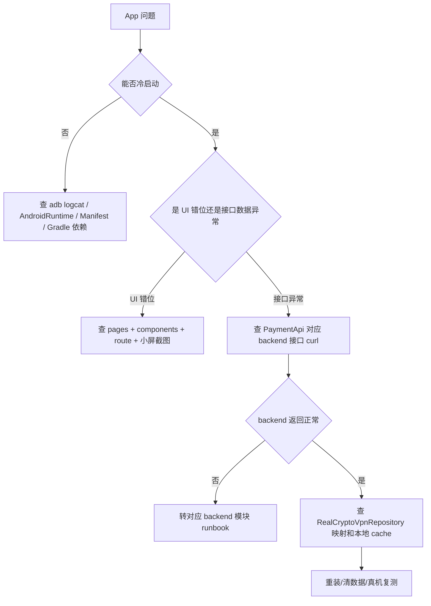

# Android App 维护 Runbook

最后更新: 2026-04-26

适用范围: `code/Android/V2rayNG`。负责真机 UI、Compose 页面、登录注册、VPN 首页、钱包、套餐、订单支付、邀请、收发款、安全中心和底部导航。

## 第 1 层: 模块定位

### 改哪里

- Android 工程根: `code/Android/V2rayNG`
- Gradle 配置: `code/Android/V2rayNG/build.gradle.kts`, `code/Android/V2rayNG/app/build.gradle.kts`
- Manifest: `code/Android/V2rayNG/app/src/main/AndroidManifest.xml`
- Compose 路由: `code/Android/V2rayNG/app/src/main/java/com/v2ray/ang/composeui/navigation/`
- P0 页面: `code/Android/V2rayNG/app/src/main/java/com/v2ray/ang/composeui/pages/p0/`
- P1 页面: `code/Android/V2rayNG/app/src/main/java/com/v2ray/ang/composeui/pages/p1/`
- P2 页面: `code/Android/V2rayNG/app/src/main/java/com/v2ray/ang/composeui/pages/p2/`
- P2 extended 页面: `code/Android/V2rayNG/app/src/main/java/com/v2ray/ang/composeui/pages/p2extended/`
- ViewModel: `code/Android/V2rayNG/app/src/main/java/com/v2ray/ang/composeui/**/viewmodel/`
- 真实仓储: `code/Android/V2rayNG/app/src/main/java/com/v2ray/ang/composeui/common/repository/RealCryptoVpnRepository.kt`
- API 接口: `code/Android/V2rayNG/app/src/main/java/com/v2ray/ang/payment/data/api/PaymentApi.kt`
- 本地 Room/cache: `code/Android/V2rayNG/app/src/main/java/com/v2ray/ang/payment/data/local/`
- 钱包本地签名/密钥: `code/Android/V2rayNG/app/src/main/java/com/v2ray/ang/payment/wallet/`
- VPN 服务: `code/Android/V2rayNG/app/src/main/java/com/v2ray/ang/service/`, `code/Android/V2rayNG/app/src/main/java/com/v2ray/ang/handler/V2RayServiceManager.kt`

### 联动哪里

- 主 backend: `https://api.residential-agent.com/api/client/v1/*`
- Admin Web 邀请页: `https://vpn.residential-agent.com/invite?code=...`
- APK 下载: `https://vpn.residential-agent.com/downloads/cryptovpn-android.apk`
- 版本更新: backend `app_versions` 表和 `client/v1/app-versions/latest`
- Sol/TRON 链侧: 间接通过 backend wallet/order 接口调用

### 验证什么

- 编译: `:app:compileFdroidDebugKotlin` 或 `:app:assembleFdroidDebug`
- 真机安装: `adb install -r ...`
- 冷启动: `adb shell am start -W -n com.v2ray.ang.fdroid/com.v2ray.ang.ui.ComposeLauncherAlias`
- logcat: 无 `FATAL EXCEPTION`、无连续 `AndroidRuntime` 崩溃
- 页面 smoke: 登录/注册/重置、VPN 首页、钱包首页、套餐、订单确认、支付确认、订单结果、收款、发送、邀请、佣金、提现、安全中心、我的、底部五入口

### 常见坑

- `code/Android/V2rayNG/app/build/` 和 `.gradle/` 有历史跟踪产物，构建后容易污染工作树；提交前只 stage 手写源码和文档。
- Compose 路由由 `CryptoVpnRouteSpec.kt`、`P0NavGraph.kt`、`P1NavGraph.kt`、`P2CoreNavGraph.kt`、`P2ExtendedNavGraph.kt` 共同控制，页面改名必须同步 route。
- `MockCryptoVpnRepository.kt` 只允许 preview/dev 语义，最终真机验收不能以 mock 作为业务通过依据。
- Android 本地钱包使用 Keystore + 本地助记词材料，不能把助记词上传到 backend。

## 第 2 层: 业务模块章节

### 主要页面与职责

| 页面/能力 | 关键文件 | 说明 |
| --- | --- | --- |
| 启动/登录/注册/重置 | `pages/p0/SplashPage.kt`, `EmailLoginPage.kt`, `EmailRegisterPage.kt`, `ResetPasswordPage.kt` | 账号入口，成功后进入钱包 onboarding 或目标 route |
| VPN 首页 | `pages/p0/VpnHomePage.kt` | 总览/连接/套餐入口 |
| 钱包首页 | `pages/p0/WalletHomePage.kt`, `pages/p2extended/WalletManagerPage.kt` | 资产总览、多钱包、默认钱包 |
| 套餐/区域/订单 | `pages/p1/PlansPage.kt`, `RegionSelectionPage.kt`, `OrderCheckoutPage.kt` | 下单前选择套餐、区域、支付网络 |
| 支付确认/结果 | `WalletPaymentConfirmPage.kt`, `OrderResultPage.kt` | 本地钱包支付、提交 tx、刷新状态 |
| 收款/发送 | `pages/p2/ReceivePage.kt`, `SendPage.kt`, `SendResultPage.kt` | 地址展示、转账构建、本地签名、代理广播 |
| 邀请/佣金/提现 | `InviteCenterPage.kt`, `CommissionLedgerPage.kt`, `WithdrawPage.kt` | growth 主入口 |
| 我的/安全中心 | `ProfilePage.kt`, `SecurityCenterPage.kt` | 账户、备份、安全提示 |
| 底部导航 | `components/navigation/CryptoVpnBottomBar.kt` | 总览/VPN/钱包/增长/我的 |

## 第 3 层: 接口 / 数据层

### 具体接口清单

接口声明事实源: `PaymentApi.kt`。

- Auth: `POST /client/v1/auth/register/email/request-code`, `POST /client/v1/auth/register/email`, `POST /client/v1/auth/login/password`, `POST /client/v1/auth/password/forgot/request-code`, `POST /client/v1/auth/password/reset`, `POST /client/v1/auth/refresh`
- Account: `GET /client/v1/me`
- Plans/Orders: `GET /client/v1/plans`, `POST /client/v1/orders`, `GET /client/v1/orders`, `GET /client/v1/orders/{orderNo}`, `GET /client/v1/orders/{orderNo}/payment-target`, `POST /client/v1/orders/{orderNo}/submit-client-tx`, `POST /client/v1/orders/{orderNo}/refresh-status`
- VPN: `GET /client/v1/vpn/regions`, `GET /client/v1/vpn/nodes`, `POST /client/v1/vpn/config/issue`, `POST /client/v1/vpn/selection`, `GET /client/v1/vpn/status`, `GET /client/v1/subscriptions/current`
- Wallet: `GET /client/v1/wallet/overview`, `GET /client/v1/wallet/balances`, `GET /client/v1/wallet/transactions`, `GET/POST /client/v1/wallet/public-addresses`, `GET/POST /client/v1/wallet/secret-backups`, `POST /client/v1/wallet/transfer/build`, `POST /client/v1/wallet/transfer/precheck`, `POST /client/v1/wallet/transfer/proxy-broadcast`
- Wallet graph: `GET /client/v1/wallets`, `POST /client/v1/wallets/create-mnemonic`, `POST /client/v1/wallets/import/mnemonic`, `POST /client/v1/wallets/import/watch-only`, `PATCH /client/v1/wallets/{walletId}`, `POST /client/v1/wallets/{walletId}/set-default`
- Growth: `GET /client/v1/referral/overview`, `GET /client/v1/referral/share-context`, `POST /client/v1/referral/bind`, `GET /client/v1/commissions/summary`, `GET /client/v1/commissions/ledger`
- Withdrawals: `POST /client/v1/withdrawals`, `GET /client/v1/withdrawals`, `GET /client/v1/withdrawals/{requestNo}`

### 关键表清单

Android 本地不应直接改线上表，但页面结果依赖:

- Auth: `accounts`, `verification_codes`, `client_sessions`
- Orders/VPN: `plans`, `vpn_regions`, `vpn_nodes`, `vpn_subscriptions`, `orders`, `order_payment_targets`, `order_payment_events`
- Wallet: `account_wallet_public_addresses`, `chain_configs`, `asset_catalog`
- Growth: `referral_bindings`, `commission_ledger`, `commission_balances`, `commission_withdraw_requests`
- App release: `app_versions`

### 发布前检查项

- `PaymentConfig` 指向正确 API base，不能指向 mock 或旧 `vpn.residential-agent.com` API。
- `MockCryptoVpnRepository` 不参与 release 路径。
- `versionName/versionCode/applicationId` 与发布渠道一致。
- APK 下载 URL 与 `app_versions.download_url` 一致。
- 真机安装后 logcat 无崩溃。
- 底部五入口均可点击，不出现导航回退死循环。

## 第 4 层: 源码 / SQL / 排障层

### 关键类 / 关键脚本清单

- `CryptoVpnRouteSpec.kt`: 所有 Compose route 名称和参数。
- `AppNavGraph.kt`, `CryptoVpnFullNavGraph.kt`: route 注册入口。
- `RealCryptoVpnRepository.kt`: UI 到真实 backend 的主要适配层。
- `PaymentRepository.kt`: Retrofit、缓存、本地数据仓储。
- `PaymentApi.kt`: client API 清单。
- `WalletSecretStore` 相关类: 本地助记词和签名材料。
- `V2RayServiceManager.kt`, `V2RayVpnService.kt`: VPN core 启停。
- `code/Android/V2rayNG/gradlew`: Android 构建入口。

### 常用 SQL 文件清单

- 主 schema: `code/backend/migrations/baseline/0001_init.up.sql`
- seed: `code/backend/migrations/seeds/0001_bootstrap_seed.sql`
- 回滚脚本: `code/backend/migrations/baseline/0001_init.down.sql`，仅本地/staging 使用。

### 故障排查顺序图



## 第 5 层: 修复 / 风险 / 回滚层

### 常见数据修复模板

Android 侧优先清本地状态，不直接修线上库:

```bash
# 只对测试设备执行。生产用户设备不可远程清数据。
adb shell pm clear com.v2ray.ang.fdroid
adb install -r app/build/outputs/apk/fdroid/debug/app-fdroid-universal-debug.apk
adb shell am start -W -n com.v2ray.ang.fdroid/com.v2ray.ang.ui.ComposeLauncherAlias
```

若是版本更新配置错误，按主 backend 修 `app_versions`，先备份再改:

```sql
BEGIN;
CREATE TABLE ops_backup_app_versions_<yyyymmdd> AS
SELECT * FROM app_versions WHERE platform = 'android' AND channel = '<channel>';

SELECT id, version_name, version_code, status, download_url, sha256
FROM app_versions
WHERE platform = 'android' AND channel = '<channel>'
ORDER BY version_code DESC;

-- 人工确认 <id> 后再定向更新，禁止无 WHERE。
UPDATE app_versions
SET status = 'DEPRECATED', updated_at = now()
WHERE id = '<bad-version-id>' AND status = 'PUBLISHED';

ROLLBACK; -- 预演时使用。正式执行时改 COMMIT，并记录 beads issue。
```

### 线上操作禁忌

- 禁止发布含 mock 仓储的正式 APK。
- 禁止把测试包 `.uiv1/.uiv2/.uiv3` 当正式升级包。
- 禁止泄露用户助记词、本地 keystore、签名材料。
- 禁止在未验证 sha256 的情况下更新 `app_versions`。
- 禁止为修 UI 直接改订单/钱包/佣金线上表。

### 回滚动作示例

```bash
# 1. 保留当前 APK
ssh <host> 'ls -lah /opt/cryptovpn/downloads/cryptovpn-android.apk'
ssh <host> 'cp -a /opt/cryptovpn/downloads/cryptovpn-android.apk /opt/cryptovpn/downloads/cryptovpn-android.apk.bad.$(date +%Y%m%d%H%M%S)'

# 2. 人工上传上一版 <previous-apk>
scp -i <key> <previous-apk> root@<host>:/opt/cryptovpn/downloads/cryptovpn-android.apk

# 3. 校验
curl -I https://vpn.residential-agent.com/downloads/cryptovpn-android.apk
sha256sum <previous-apk>

# 4. 再按 app_versions 表把最新 PUBLISHED 指向上一版信息。
```
