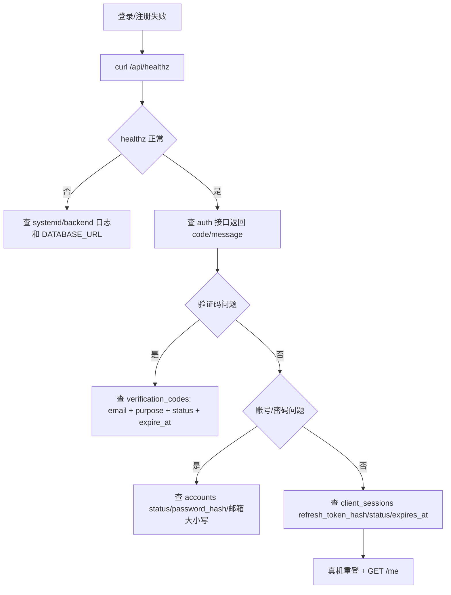

# Auth & Accounts 维护 Runbook

最后更新: 2026-04-26

适用范围: 登录、注册、验证码、密码重置、token 刷新、账号状态、会话、`GET /me`。

## 第 1 层: 模块定位

### 改哪里

- backend auth: `code/backend/src/modules/auth/`
- backend account: `code/backend/src/modules/accounts/`
- DTO: `code/backend/src/modules/auth/dto/`
- Android API: `code/Android/V2rayNG/app/src/main/java/com/v2ray/ang/payment/data/api/PaymentApi.kt`
- Android 登录页: `code/Android/V2rayNG/app/src/main/java/com/v2ray/ang/composeui/pages/p0/EmailLoginPage.kt`
- Android 注册页: `code/Android/V2rayNG/app/src/main/java/com/v2ray/ang/composeui/pages/p0/EmailRegisterPage.kt`
- Android 重置页: `code/Android/V2rayNG/app/src/main/java/com/v2ray/ang/composeui/pages/p0/ResetPasswordPage.kt`
- e2e: `code/backend/test/auth.e2e-spec.ts`, `code/backend/test/auth-postgres.e2e-spec.ts`

### 联动哪里

- 邀请绑定: 登录/注册后 Android 会尝试绑定 pending referral。
- 钱包创建: 登录后 wallet onboarding 依赖 account id。
- 后台 admin auth 是独立模块: `code/backend/src/modules/admin/auth/`。

### 验证什么

```bash
pnpm --dir code/backend typecheck
pnpm --dir code/backend test:e2e -- auth.e2e-spec.ts auth-postgres.e2e-spec.ts
curl https://api.residential-agent.com/api/healthz
```

真机验证:

```bash
adb logcat -c
adb shell am start -W -n com.v2ray.ang.fdroid/com.v2ray.ang.ui.ComposeLauncherAlias
adb logcat -d | rg -i 'auth|login|register|AndroidRuntime|FATAL'
```

### 常见坑

- `client_sessions` 当前有单账号单 ACTIVE session 唯一索引，重复登录可能淘汰旧 session。
- `verification_codes` 有 purpose 和 expire 维度，注册和重置密码不能混用。
- 账号持久化曾出现进程内存/测试库误用问题，真实环境必须确认 `DATABASE_URL` 指向 `127.0.0.1:15432/cryptovpn`。
- 邮件发送/验证码如果未接真实邮件服务，不能把 mock 验证码当线上通过。

## 第 2 层: 业务模块章节

### 维护点

| 能力 | 主要文件 | 维护动作 |
| --- | --- | --- |
| 注册验证码 | `auth.controller.ts`, `auth.service.ts`, `register-email-code.request.ts` | 查验证码生成、过期、消费状态 |
| 邮箱注册 | `register-email.request.ts`, `auth.service.ts` | 查账号唯一性、referral code、状态 |
| 登录 | `login-password.request.ts`, `auth.service.ts` | 查 password hash、session 写入、token |
| token 刷新 | `refresh-token.request.ts`, `auth.service.ts` | 查 refresh token hash 和 session 状态 |
| 密码重置 | `password-reset*.request.ts` | 查 reset purpose 与验证码消费 |
| 当前用户 | `accounts.controller.ts`, `accounts.service.ts` | 查 `GET /me` envelope 和 account 状态 |

## 第 3 层: 接口 / 数据层

### 具体接口清单

- `POST /api/client/v1/auth/register/email/request-code`
- `POST /api/client/v1/auth/register/email`
- `POST /api/client/v1/auth/login/password`
- `POST /api/client/v1/auth/refresh`
- `POST /api/client/v1/auth/logout`
- `POST /api/client/v1/auth/password/forgot/request-code`
- `POST /api/client/v1/auth/password/reset`
- `GET /api/client/v1/me`
- `GET /api/client/v1/me/session`

### 关键表清单

- `accounts`: 账号主体，邮箱、状态、邀请码、邀请人。
- `verification_codes`: 注册/重置验证码。
- `client_sessions`: refresh token、access jti、状态、过期时间。
- `account_installations`: 设备安装标识和 app 版本观测。
- `audit_logs`: 重要 admin/system/account 操作审计。

### 发布前检查项

- `AUTH_TOKEN_SECRET` 非默认值。
- `DATABASE_URL` 不是测试库。
- `client_sessions` 单 active 约束符合业务预期。
- Android 登录/注册成功后能读取 `GET /me`。
- 注册后 pending referral 不应阻断正常登录。

## 第 4 层: 源码 / SQL / 排障层

### 关键类 / 关键脚本清单

- `code/backend/src/modules/auth/auth.controller.ts`
- `code/backend/src/modules/auth/auth.service.ts`
- `code/backend/src/modules/accounts/accounts.controller.ts`
- `code/backend/src/modules/accounts/accounts.service.ts`
- `code/backend/src/modules/database/postgres-runtime-state.repository.ts`
- `code/backend/test/auth-postgres.e2e-spec.ts`
- `code/backend/migrations/baseline/0001_init.up.sql`

### 常用 SQL 文件清单

- `code/backend/migrations/baseline/0001_init.up.sql`
- `code/backend/migrations/seeds/0001_bootstrap_seed.sql`
- `final_engineering_delivery_package/10_postgresql_core_ddl.sql`

### 故障排查顺序图



## 第 5 层: 修复 / 风险 / 回滚层

### 常见数据修复模板

账号状态修复必须先备份、预览、定向:

```sql
BEGIN;
CREATE TABLE ops_backup_accounts_<yyyymmdd> AS
SELECT * FROM accounts WHERE email = '<email>';

SELECT id, account_no, email, status, email_verified_at, created_at, updated_at
FROM accounts
WHERE email = '<email>';

-- 示例: 仅在人工确认邮箱已验证但状态异常时使用。
UPDATE accounts
SET status = 'ACTIVE', email_verified_at = COALESCE(email_verified_at, now()), updated_at = now()
WHERE id = '<account-id>' AND email = '<email>' AND status = 'PENDING_VERIFY';

SELECT id, email, status, email_verified_at FROM accounts WHERE id = '<account-id>';
ROLLBACK;
```

清理异常 session:

```sql
BEGIN;
CREATE TABLE ops_backup_client_sessions_<yyyymmdd> AS
SELECT * FROM client_sessions WHERE account_id = '<account-id>';

SELECT id, status, issued_at, expires_at, last_refresh_at
FROM client_sessions
WHERE account_id = '<account-id>'
ORDER BY created_at DESC;

UPDATE client_sessions
SET status = 'REVOKED', invalidated_reason = 'ops_manual_revoke', updated_at = now()
WHERE id = '<session-id>' AND account_id = '<account-id>' AND status = 'ACTIVE';

ROLLBACK;
```

### 线上操作禁忌

- 禁止直接明文写入密码或 token。
- 禁止把验证码明文打印到日志或聊天。
- 禁止批量激活账号。
- 禁止删除 `accounts`；有账务/订单关联时只能冻结或补偿。
- 禁止绕过唯一索引插入重复 email/referral code。

### 回滚动作示例

- auth 代码发布异常: 回滚 backend dist 到上一版，重启 `cryptovpn-backend.service`，验证 `/api/healthz`、登录、`GET /me`。
- 数据修复异常: 使用 `ops_backup_accounts_<yyyymmdd>` 或 `ops_backup_client_sessions_<yyyymmdd>` 对单账号恢复原字段，禁止恢复全表。

```sql
BEGIN;
SELECT * FROM ops_backup_accounts_<yyyymmdd> WHERE id = '<account-id>';

UPDATE accounts a
SET status = b.status,
    email_verified_at = b.email_verified_at,
    updated_at = now()
FROM ops_backup_accounts_<yyyymmdd> b
WHERE a.id = b.id AND a.id = '<account-id>';

ROLLBACK;
```
