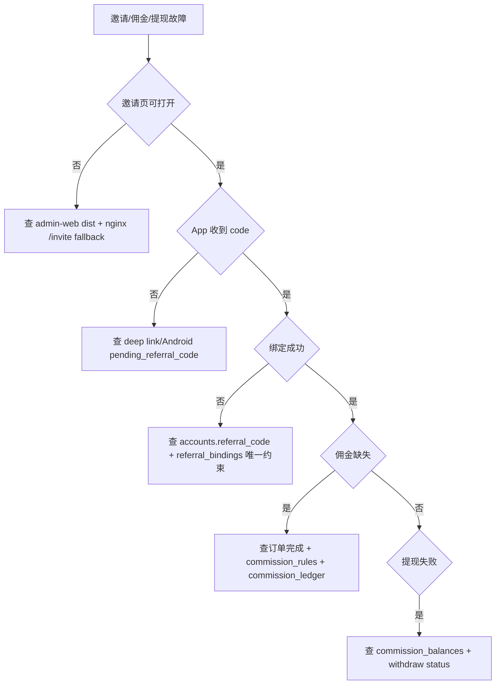

# Referral / Commission / Withdrawal 维护 Runbook

最后更新: 2026-04-26

适用范围: 邀请码、邀请页、邀请码绑定、佣金汇总/流水、提现申请、后台提现审核。

## 第 1 层: 模块定位

### 改哪里

- referral backend: `code/backend/src/modules/referral/`
- withdrawals backend: `code/backend/src/modules/withdrawals/`
- admin withdrawals: `code/backend/src/modules/admin/withdrawals/`
- Android 邀请页: `code/Android/V2rayNG/app/src/main/java/com/v2ray/ang/composeui/pages/p2/InviteCenterPage.kt`
- Android 佣金页: `code/Android/V2rayNG/app/src/main/java/com/v2ray/ang/composeui/pages/p2/CommissionLedgerPage.kt`
- Android 提现页: `code/Android/V2rayNG/app/src/main/java/com/v2ray/ang/composeui/pages/p2/WithdrawPage.kt`
- Admin Web 提现页: `code/admin-web/src/pages/Withdrawals.tsx`
- 邀请落地页: `code/admin-web/src/pages/InviteLanding.tsx`

### 联动哪里

- 注册/登录后 Android 会尝试 `POST /referral/bind`。
- 佣金依赖订单完成和 `commission_rules`。
- 提现依赖 `commission_balances.available_amount`。
- Admin Web `/invite` 负责 Web 到 App deep link。

### 验证什么

```bash
pnpm --dir code/backend test:e2e -- referral-withdrawal.e2e-spec.ts
npm --prefix code/admin-web run build
curl "https://vpn.residential-agent.com/invite?code=CHECK"
```

App:

- 打开 `v2rayng://invite?code=FLOW2026`
- 登录/注册后检查绑定结果。
- 邀请中心显示邀请码和分享链接。
- 佣金汇总/流水分页。
- 提现余额不足时返回可解释错误。

### 常见坑

- 直装 APK 无法自动完成安装归因；用户安装后仍需从邀请页点“打开 App”。
- `referral_bindings` 对 invitee 是唯一绑定，不允许反复改上级。
- 二级分佣依赖 inviter 的 inviter。
- 提现状态机不能直接从 `SUBMITTED` 跳到 `COMPLETED`。

## 第 2 层: 业务模块章节

| 能力 | 主要文件 | 验证 |
| --- | --- | --- |
| 邀请概览 | `referral.controller.ts`, `referral.service.ts` | `GET /referral/overview` |
| 分享上下文 | `referral.service.ts`, `InviteLanding.tsx` | `GET /referral/share-context`, `/invite?code=` |
| 邀请绑定 | `referral-bind.request.ts`, `referral.service.ts` | `POST /referral/bind` |
| 佣金汇总 | `referral.service.ts` | `GET /commissions/summary` |
| 佣金流水 | `referral.service.ts` | `GET /commissions/ledger` |
| 提现申请 | `withdrawals.controller.ts`, `withdrawals.service.ts` | `POST /withdrawals` |
| 后台提现 | `admin-withdrawals.controller.ts`, `admin-withdrawals.service.ts` | `GET /admin/v1/withdrawals` |

## 第 3 层: 接口 / 数据层

### 具体接口清单

Client:

- `GET /api/client/v1/referral/overview`
- `GET /api/client/v1/referral/share-context`
- `GET /api/client/v1/referral/resolve-public`
- `POST /api/client/v1/referral/bind`
- `GET /api/client/v1/commissions/summary`
- `GET /api/client/v1/commissions/ledger`
- `POST /api/client/v1/withdrawals`
- `GET /api/client/v1/withdrawals`
- `GET /api/client/v1/withdrawals/:requestNo`

Admin:

- `GET /api/admin/v1/withdrawals`

Web:

- `GET /invite?code=<referralCode>` routed to `code/admin-web/src/pages/InviteLanding.tsx`

### 关键表清单

- `accounts` (`referral_code`, `inviter_account_id`)
- `referral_bindings`
- `commission_rules`
- `commission_ledger`
- `commission_balances`
- `commission_withdraw_requests`
- `orders`
- `audit_logs`

### 发布前检查项

- `commission_rules` 有 active 规则。
- `commission_balances` 与 `commission_ledger` 汇总一致。
- `/invite` nginx fallback 到 Admin Web `index.html`。
- `VITE_PUBLIC_ANDROID_APK_URL` 指向真实 APK。
- Android deep link `v2rayng://invite?code=...` 能保存 pending referral。

## 第 4 层: 源码 / SQL / 排障层

### 关键类 / 关键脚本清单

- `code/backend/src/modules/referral/referral.service.ts`
- `code/backend/src/modules/referral/referral.controller.ts`
- `code/backend/src/modules/withdrawals/withdrawals.service.ts`
- `code/backend/src/modules/admin/withdrawals/admin-withdrawals.service.ts`
- `code/admin-web/src/pages/InviteLanding.tsx`
- `code/Android/V2rayNG/app/src/main/java/com/v2ray/ang/composeui/pages/p2/InviteCenterPage.kt`
- `code/backend/test/referral-withdrawal.e2e-spec.ts`

### 常用 SQL 文件清单

- `code/backend/migrations/baseline/0001_init.up.sql`
- `docs/plans/2026-04-26-referral-withdrawal-backfill-plan.md`
- `docs/RCB20_AUTH_RUNTIME_GAP.md`
- `docs/RCB20_LIVE_PAYMENT_GUIDE.md`

### 故障排查顺序图



## 第 5 层: 修复 / 风险 / 回滚层

### 常见数据修复模板

邀请绑定补录必须先确认 invitee 从未绑定:

```sql
BEGIN;
CREATE TABLE ops_backup_referral_<yyyymmdd> AS
SELECT * FROM referral_bindings WHERE invitee_account_id = '<invitee_account_id>';

SELECT id, account_no, referral_code, inviter_account_id
FROM accounts
WHERE id IN ('<invitee_account_id>', '<inviter_account_id>');

SELECT * FROM referral_bindings WHERE invitee_account_id = '<invitee_account_id>';

-- 仅当不存在绑定且有明确证据时执行。
INSERT INTO referral_bindings (
  invitee_account_id,
  inviter_level1_account_id,
  inviter_level2_account_id,
  code_used,
  status,
  locked_at
)
SELECT
  '<invitee_account_id>',
  '<inviter_account_id>',
  inviter_account_id,
  '<code_used>',
  'BOUND',
  now()
FROM accounts
WHERE id = '<inviter_account_id>'
  AND NOT EXISTS (
    SELECT 1 FROM referral_bindings WHERE invitee_account_id = '<invitee_account_id>'
  );

ROLLBACK;
```

佣金余额重算预览:

```sql
-- 只读预览，不直接更新。
SELECT beneficiary_account_id,
       settlement_asset_code,
       settlement_network_code,
       sum(CASE WHEN status = 'FROZEN' THEN settlement_amount ELSE 0 END) AS frozen_calc,
       sum(CASE WHEN status = 'AVAILABLE' THEN settlement_amount ELSE 0 END) AS available_calc
FROM commission_ledger
WHERE beneficiary_account_id = '<account_id>'
GROUP BY beneficiary_account_id, settlement_asset_code, settlement_network_code;
```

提现状态修复:

```sql
BEGIN;
CREATE TABLE ops_backup_withdraw_<yyyymmdd> AS
SELECT * FROM commission_withdraw_requests WHERE request_no = '<request_no>';

SELECT * FROM commission_withdraw_requests WHERE request_no = '<request_no>';

-- 示例: 链上广播失败后退回审核，必须同步余额补偿。
UPDATE commission_withdraw_requests
SET status = 'FAILED', fail_reason = '<reason>', updated_at = now()
WHERE request_no = '<request_no>' AND status IN ('BROADCASTING','CHAIN_CONFIRMING');

ROLLBACK;
```

### 线上操作禁忌

- 禁止给已绑定用户改上级，除非有审计和产品确认。
- 禁止用负数流水抵扣佣金。
- 禁止跳过 `commission_balances` 改提现状态。
- 禁止把提现直接置为 `COMPLETED` 而无 tx_hash 和链上验证。
- 禁止把邀请页下载链接指向测试 APK。

### 回滚动作示例

- 邀请页发布错: 回滚 `code/admin-web/dist` 到上一版并 reload nginx，验证 `/invite?code=CHECK`。
- 绑定补录错: 用 `ops_backup_referral_<yyyymmdd>` 删除错误新增绑定或恢复原状态；只对单 invitee 操作。
- 提现状态错: 从 `ops_backup_withdraw_<yyyymmdd>` 恢复单 request，并同步恢复 `commission_balances`。
