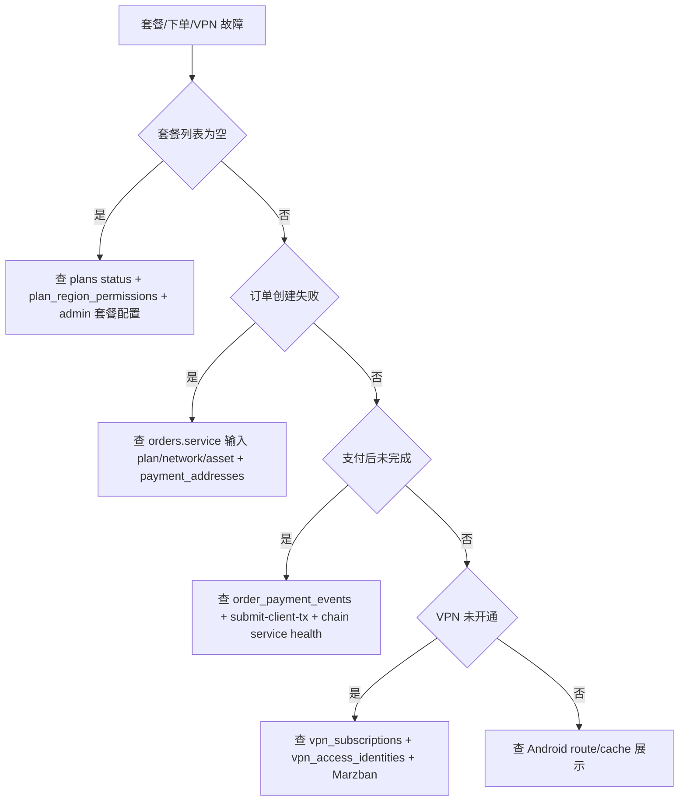

# Plans / Orders / VPN 维护 Runbook

最后更新: 2026-04-26

适用范围: 套餐、下单、支付目标、订单状态推进、VPN 区域/节点/订阅/开通。

## 第 1 层: 模块定位

### 改哪里

- 套餐 client API: `code/backend/src/modules/plans/`
- 订单 client API: `code/backend/src/modules/orders/`
- 支付匹配: `code/backend/src/modules/orders/order-payment-matcher.service.ts`, `order-payment-matcher.scheduler.ts`
- VPN client API: `code/backend/src/modules/vpn/`
- Marzban 集成: `code/backend/src/modules/marzban/`
- 开通服务: `code/backend/src/modules/provisioning/`
- Android 套餐/订单页: `code/Android/V2rayNG/app/src/main/java/com/v2ray/ang/composeui/pages/p1/`
- Admin 套餐/节点页: `code/admin-web/src/pages/Plans.tsx`, `Regions.tsx`, `Nodes.tsx`
- Admin API: `code/backend/src/modules/admin/plans/`, `admin/vpn/`, `admin/orders/`

### 联动哪里

- Wallet & Chain 提供支付 tx 验证和广播结果。
- Referral & Commission 依赖订单完成后生成佣金。
- VPN subscription 依赖订单 `COMPLETED`。
- Admin Web 可改变套餐、区域、节点配置。

### 验证什么

```bash
pnpm --dir code/backend typecheck
pnpm --dir code/backend test:e2e -- orders.e2e-spec.ts orders-postgres.e2e-spec.ts vpn.e2e-spec.ts vpn-postgres.e2e-spec.ts
curl https://api.residential-agent.com/api/client/v1/plans
```

真机页面:

- `plans`
- `region_selection?planId=<plan>`
- `order_checkout/<plan>`
- `wallet_payment_confirm/<orderNo>`
- `order_result/<orderNo>`

### 常见坑

- `plans.status='ACTIVE'` 才会出现在客户端。
- 套餐区域权限由 `plan_region_permissions` 控制；缺权限会导致选区域异常。
- `order_payment_targets` 必须和 `orders` 一对一，不能手工给一个订单多个 active target。
- 支付状态推进不能只改 `orders.status`，还要看 `order_payment_events`、订阅、VPN identity。
- Marzban 当前和数据服务分离，不能把 Marzban sqlite 误当主业务库。

## 第 2 层: 业务模块章节

### 维护点

| 能力 | 主要文件 | 验证 |
| --- | --- | --- |
| 套餐列表 | `plans.controller.ts`, `plans.service.ts` | `GET /client/v1/plans` |
| 下单 | `orders.controller.ts`, `orders.service.ts`, `create-order.request.ts` | `POST /client/v1/orders` |
| 支付目标 | `orders.service.ts`, `payment-asset-catalog.ts` | `GET /orders/{orderNo}/payment-target` |
| tx 提交 | `submit-client-tx.request.ts`, `order-payment-matcher.service.ts` | `POST /submit-client-tx` |
| 状态刷新 | `refresh-order-status.request.ts`, matcher scheduler | `POST /refresh-status` |
| VPN 区域/节点 | `vpn.controller.ts`, `vpn.service.ts` | `GET /vpn/regions`, `GET /vpn/nodes` |
| VPN 开通 | `provisioning.service.ts`, `marzban.service.ts` | `GET /subscriptions/current`, `GET /vpn/status` |

## 第 3 层: 接口 / 数据层

### 具体接口清单

Client:

- `GET /api/client/v1/plans`
- `GET /api/client/v1/orders`
- `POST /api/client/v1/orders`
- `GET /api/client/v1/orders/:orderNo`
- `GET /api/client/v1/orders/:orderNo/payment-target`
- `POST /api/client/v1/orders/:orderNo/submit-client-tx`
- `POST /api/client/v1/orders/:orderNo/refresh-status`
- `GET /api/client/v1/vpn/regions`
- `GET /api/client/v1/vpn/nodes`
- `POST /api/client/v1/vpn/config/issue`
- `POST /api/client/v1/vpn/selection`
- `GET /api/client/v1/vpn/status`
- `GET /api/client/v1/subscriptions/current`

Admin:

- `GET /api/admin/v1/plans`
- `POST /api/admin/v1/plans`
- `PUT /api/admin/v1/plans/:planId`
- `GET /api/admin/v1/orders`
- `GET /api/admin/v1/orders/:orderNo`
- `GET /api/admin/v1/vpn/regions`
- `GET /api/admin/v1/vpn/nodes`

### 关键表清单

- `plans`
- `vpn_regions`
- `plan_region_permissions`
- `vpn_nodes`
- `vpn_access_identities`
- `vpn_subscriptions`
- `orders`
- `order_payment_targets`
- `order_payment_events`
- `chain_configs`
- `asset_catalog`
- `payment_addresses`
- `system_configs`

### 发布前检查项

- `plans` 至少有一个 `ACTIVE` 套餐。
- 每个可售套餐的区域权限符合 `region_access_policy`。
- `payment_addresses` 对可支付网络/资产存在 active 地址。
- `chain_configs.required_confirmations` 与链侧服务能力一致。
- `SOLANA_SERVICE_ENABLED` / `TRON_SERVICE_ENABLED` 与真实环境一致。
- `MARZBAN_*` 配置可用，`/api/healthz` 不降级。

## 第 4 层: 源码 / SQL / 排障层

### 关键类 / 关键脚本清单

- `code/backend/src/modules/orders/orders.service.ts`
- `code/backend/src/modules/orders/order-payment-matcher.service.ts`
- `code/backend/src/modules/orders/order-payment-matcher.scheduler.ts`
- `code/backend/src/modules/vpn/vpn.service.ts`
- `code/backend/src/modules/provisioning/provisioning.service.ts`
- `code/backend/src/modules/marzban/marzban.service.ts`
- `code/backend/src/modules/admin/plans/admin-plans.service.ts`
- `code/backend/src/modules/admin/vpn/admin-vpn.service.ts`
- `code/backend/test/orders-postgres.e2e-spec.ts`
- `code/backend/test/vpn-postgres.e2e-spec.ts`

### 常用 SQL 文件清单

- `code/backend/migrations/baseline/0001_init.up.sql`
- `code/backend/migrations/seeds/0001_bootstrap_seed.sql`
- `docs/ANDROID_ORDER_FLOW_PRECHECK.md`
- `docs/ANDROID_PAYMENT_CONFIRM_DETAILS.md`
- `docs/RCB20_LIVE_PAYMENT_GUIDE.md`
- `docs/SERVER_PAYMENT_PROVISION_READINESS.md`

### 故障排查顺序图



## 第 5 层: 修复 / 风险 / 回滚层

### 常见数据修复模板

启用误停套餐:

```sql
BEGIN;
CREATE TABLE ops_backup_plans_<yyyymmdd> AS
SELECT * FROM plans WHERE plan_code = '<plan_code>';

SELECT id, plan_code, status, price_usd, region_access_policy, display_order
FROM plans WHERE plan_code = '<plan_code>';

UPDATE plans
SET status = 'ACTIVE', updated_at = now()
WHERE plan_code = '<plan_code>' AND status = 'DISABLED';

ROLLBACK;
```

订单状态补偿只允许在已确认支付事件后执行:

```sql
BEGIN;
CREATE TABLE ops_backup_order_fix_<yyyymmdd> AS
SELECT * FROM orders WHERE order_no = '<order_no>';

SELECT o.order_no, o.status, o.submitted_client_tx_hash, e.tx_hash, e.status AS event_status, e.confirmations
FROM orders o
LEFT JOIN order_payment_events e ON e.order_id = o.id
WHERE o.order_no = '<order_no>';

-- 仅当 payment event 已 CONFIRMED 且业务已人工确认时，按状态机补偿。
UPDATE orders
SET status = 'PAID', paid_at = COALESCE(paid_at, now()), confirmed_at = COALESCE(confirmed_at, now()), updated_at = now()
WHERE order_no = '<order_no>' AND status IN ('PAYMENT_DETECTED','CONFIRMING');

ROLLBACK;
```

订阅补偿必须同时记录订单、套餐、账号:

```sql
BEGIN;
CREATE TABLE ops_backup_subscription_<yyyymmdd> AS
SELECT * FROM vpn_subscriptions WHERE account_id = '<account_id>';

SELECT * FROM orders WHERE order_no = '<order_no>';
SELECT * FROM vpn_subscriptions WHERE account_id = '<account_id>';

-- 示例只作为模板，expire_at 必须由订单套餐周期计算后人工填入。
UPDATE vpn_subscriptions
SET status = 'ACTIVE',
    plan_id = '<plan_id>',
    started_at = COALESCE(started_at, now()),
    expire_at = '<computed_expire_at>',
    updated_at = now()
WHERE account_id = '<account_id>' AND status IN ('PENDING_ACTIVATION','EXPIRED','SUSPENDED');

ROLLBACK;
```

### 线上操作禁忌

- 禁止直接把未支付订单改为 `COMPLETED`。
- 禁止跳过 `order_payment_events` 审计记录。
- 禁止删除订单、支付事件和订阅。
- 禁止在生产跑 `0001_init.down.sql`。
- 禁止把 disabled plan 直接改 active 后不验证区域和支付网络。
- 禁止在 Marzban 不可用时批量发放 VPN 身份。

### 回滚动作示例

- 套餐配置发布错: 将错误套餐改回 `DRAFT` 或 `DISABLED`，不要删除；验证客户端套餐列表。
- backend 代码导致订单失败: 回滚 `/opt/cryptovpn/backend/dist`，重启 `cryptovpn-backend.service`，验证创建订单和 payment-target。
- 数据补偿错误: 按 `ops_backup_*` 单订单/单账号恢复，不做全表恢复。
