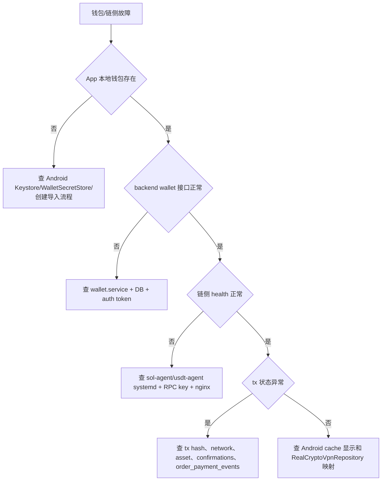

# Wallet / Chain 维护 Runbook

最后更新: 2026-04-26

适用范围: 钱包首页、资产余额、收款地址、创建/导入钱包、助记词备份、转账构建、本地签名、代理广播、Solana 链侧、TRON 链侧。

## 第 1 层: 模块定位

### 改哪里

- backend wallet: `code/backend/src/modules/wallet/`
- Solana client: `code/backend/src/modules/solana-client/`
- TRON client: `code/backend/src/modules/tron-client/`
- payment asset catalog: `code/backend/src/modules/payments/payment-asset-catalog.ts`
- Sol Agent: `code/sol-agent/src/modules/`
- USDT Chain: `code/backend-chain-usdt/src/modules/chain/`
- Android wallet pages: `code/Android/V2rayNG/app/src/main/java/com/v2ray/ang/composeui/pages/p0/WalletHomePage.kt`, `pages/p2/ReceivePage.kt`, `SendPage.kt`, `pages/p2extended/*Wallet*`
- Android local wallet: `code/Android/V2rayNG/app/src/main/java/com/v2ray/ang/payment/wallet/`

### 联动哪里

- Orders 依赖链侧 tx 校验。
- Android 本地签名后调用 backend `wallet/transfer/proxy-broadcast`。
- Backend 通过 `SOLANA_SERVICE_URL`、`TRON_SERVICE_URL` 调链侧服务。
- Secret backup 只存密文和元数据，不存明文助记词。

### 验证什么

```bash
pnpm --dir code/backend test:e2e -- wallet.e2e-spec.ts wallet-postgres.e2e-spec.ts
pnpm --dir code/backend typecheck
pnpm --dir code/sol-agent typecheck
pnpm --dir code/backend-chain-usdt typecheck
curl https://sol.residential-agent.com/api/healthz
curl https://usdt.residential-agent.com/api/healthz
```

Android 真机:

- 创建钱包
- 备份/确认助记词
- 钱包首页余额展示
- 收款页地址展示
- 发送 precheck/build/local sign/proxy broadcast

### 常见坑

- 钱包私钥/助记词不入库，不能在 backend 数据修复里补明文私钥。
- 公开地址表 `account_wallet_public_addresses` 只是元数据。
- Solana 和 TRON 默认配置可能被 disabled，必须看 `.env.local` 和 `/api/healthz` 聚合结果。
- TRON service README 早期写过 mock 状态，当前真实状态以 `环境测试服务器.md` 和实际 `/api/healthz` 为准。

## 第 2 层: 业务模块章节

| 能力 | 关键文件 | 验证 |
| --- | --- | --- |
| 钱包概览/余额 | `wallet.controller.ts`, `wallet.service.ts`, `wallet-snapshot.service.ts` | `GET /wallet/overview`, `GET /wallet/balances` |
| 公开地址 | `wallet-public-address-policy.ts`, `wallet.controller.ts` | `GET/POST /wallet/public-addresses` |
| 多钱包 | `wallets.controller.ts`, `wallet.service.ts` | `GET /wallets`, `POST /wallets/create-mnemonic` |
| secret backup | `wallet-backup-crypto.service.ts`, `wallet-backup-relay.service.ts` | `POST /wallet/secret-backups` |
| 转账构建 | `wallet.service.ts`, Sol/TRON clients | `POST /wallet/transfer/build` |
| 转账预检 | `wallet.service.ts` | `POST /wallet/transfer/precheck` |
| 代理广播 | `solana-client.service.ts`, `tron-client.service.ts` | `POST /wallet/transfer/proxy-broadcast` |
| Sol tx 查询 | `code/sol-agent/src/modules/transactions/` | `GET /api/v1/transactions/:signature` |
| TRON tx 查询 | `code/backend-chain-usdt/src/modules/chain/` | `GET /api/v1/chain/tx/:hash` |

## 第 3 层: 接口 / 数据层

### 具体接口清单

Client wallet:

- `GET /api/client/v1/wallet/chains`
- `GET /api/client/v1/wallet/assets/catalog`
- `GET /api/client/v1/wallet/overview`
- `GET /api/client/v1/wallet/balances`
- `GET /api/client/v1/wallet/transactions`
- `GET /api/client/v1/wallet/lifecycle`
- `POST /api/client/v1/wallet/lifecycle`
- `GET /api/client/v1/wallet/receive-context`
- `GET/POST /api/client/v1/wallet/public-addresses`
- `GET/POST /api/client/v1/wallet/secret-backups`
- `GET /api/client/v1/wallet/secret-backups/export`
- `POST /api/client/v1/wallet/transfer/build`
- `POST /api/client/v1/wallet/transfer/precheck`
- `POST /api/client/v1/wallet/transfer/proxy-broadcast`
- `GET /api/client/v1/wallets`
- `POST /api/client/v1/wallets/create-mnemonic`
- `POST /api/client/v1/wallets/import/mnemonic`
- `POST /api/client/v1/wallets/import/watch-only`

Sol Agent:

- `GET /api/healthz`
- `POST /api/internal/v1/address`
- `GET /api/internal/v1/address/:accountId`
- `GET /api/internal/v1/payment/:address/status`
- `POST /api/internal/v1/payment/detect`
- `POST /api/internal/v1/payment/scan-incoming`
- `POST /api/internal/v1/payment/verify`
- `GET /api/v1/transactions/:signature`

USDT Chain:

- `GET /api/healthz`
- `GET /api/healthz/ready`
- `GET /api/v1/chain/tx/:hash`
- `POST /api/v1/chain/tx/batch`
- `POST /api/v1/chain/broadcast`
- `GET /api/v1/chain/block/current`
- `GET /api/v1/chain/address/validate?address=...`
- `GET /api/v1/chain/contract/usdt`
- `GET /api/v1/chain/capabilities`

### 关键表清单

- `chain_configs`
- `asset_catalog`
- `payment_addresses`
- `account_wallet_public_addresses`
- `orders`
- `order_payment_events`
- `system_configs`

当前 baseline 没有独立的钱包私钥表，符合自托管约束。

### 发布前检查项

- `SOLANA_SERVICE_ENABLED` / `TRON_SERVICE_ENABLED` 与目标环境一致。
- `SOLANA_SERVICE_URL` 指向 `https://sol.residential-agent.com/api` 或本地对应地址。
- `TRON_SERVICE_URL` 指向 `https://usdt.residential-agent.com/api` 或本地对应地址。
- `chain_configs` 中 active 网络和 Android 可选网络一致。
- `asset_catalog.order_payable` 与套餐支付网络一致。
- secret backup 不返回明文助记词。

## 第 4 层: 源码 / SQL / 排障层

### 关键类 / 关键脚本清单

- `code/backend/src/modules/wallet/wallet.service.ts`
- `code/backend/src/modules/wallet/wallet.controller.ts`
- `code/backend/src/modules/wallet/wallets.controller.ts`
- `code/backend/src/modules/wallet/wallet-backup-crypto.service.ts`
- `code/backend/src/modules/solana-client/solana-client.service.ts`
- `code/backend/src/modules/tron-client/tron-client.service.ts`
- `code/sol-agent/src/modules/payment/payment.service.ts`
- `code/sol-agent/src/modules/transactions/transactions.service.ts`
- `code/backend-chain-usdt/src/modules/chain/chain.service.ts`
- `code/Android/V2rayNG/app/src/main/java/com/v2ray/ang/payment/wallet/`

### 常用 SQL 文件清单

- `code/backend/migrations/baseline/0001_init.up.sql`
- `docs/plans/2026-04-16-wallet-custody-and-send-architecture.md`
- `docs/plans/2026-04-21-wallet-local-first-cache-and-price.md`
- `docs/CHAIN_USDT_INTEGRATION.md`
- `docs/solana-client-wiring.md`
- `docs/CUSTOM_TOKEN_SEARCH_PROVIDER_SETUP.md`

### 故障排查顺序图



## 第 5 层: 修复 / 风险 / 回滚层

### 常见数据修复模板

修公开地址元数据:

```sql
BEGIN;
CREATE TABLE ops_backup_wallet_public_addresses_<yyyymmdd> AS
SELECT * FROM account_wallet_public_addresses WHERE account_id = '<account_id>';

SELECT * FROM account_wallet_public_addresses
WHERE account_id = '<account_id>' AND network_code = '<network>' AND asset_code = '<asset>';

-- 只修公开地址元数据；不要写入私钥/助记词。
UPDATE account_wallet_public_addresses
SET is_default = false, updated_at = now()
WHERE account_id = '<account_id>' AND network_code = '<network>' AND asset_code = '<asset>';

INSERT INTO account_wallet_public_addresses (account_id, network_code, asset_code, address, is_default)
SELECT '<account_id>', '<network>', '<asset>', '<address>', true
WHERE NOT EXISTS (
  SELECT 1 FROM account_wallet_public_addresses
  WHERE account_id = '<account_id>' AND network_code = '<network>' AND asset_code = '<asset>' AND address = '<address>'
);

ROLLBACK;
```

修链配置启停:

```sql
BEGIN;
CREATE TABLE ops_backup_chain_configs_<yyyymmdd> AS
SELECT * FROM chain_configs WHERE network_code = '<network>';

SELECT network_code, public_rpc_url, proxy_rpc_url, proxy_broadcast_enabled, is_active
FROM chain_configs WHERE network_code = '<network>';

UPDATE chain_configs
SET is_active = true, updated_at = now()
WHERE network_code = '<network>' AND is_active = false;

ROLLBACK;
```

### 线上操作禁忌

- 禁止保存、打印、上传明文助记词或私钥。
- 禁止让 backend 代签用户转账。
- 禁止在未确认 network/asset 的情况下广播交易。
- 禁止把 Solana tx 当 TRON tx 查询，反之亦然。
- 禁止直接改 `order_payment_events` 为 `CONFIRMED` 而不核验链上交易。
- 禁止在生产使用公共 RPC 作为唯一高频查询依赖而不观察限流。

### 回滚动作示例

- 链侧服务代码异常: 回滚对应 `/opt/sol-agent` 或 USDT agent 目录到上一版，重启 systemd，验证 `/api/healthz` 和一笔已知 tx 查询。
- backend wallet 代码异常: 回滚 backend，验证 `GET /wallet/overview`、`POST /wallet/transfer/precheck`。
- 错误公开地址: 用 `ops_backup_wallet_public_addresses_<yyyymmdd>` 单账号恢复。
