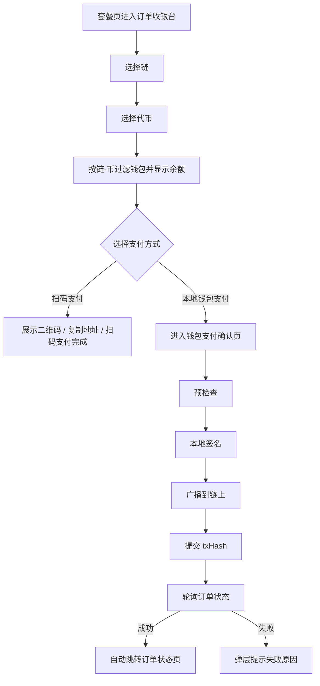

# VPN 收银台与钱包支付交互改造计划

> 创建日期: 2026-04-22
> 优先级: P1
> 预估工时: 8-12 小时
> 当前负责人: Codex / Liaojiang Dev

## 需求摘要

本次改造聚焦 Android Compose 的 VPN 购买链路，目标不是单点修补，而是把 `plans -> region_selection -> order_checkout -> wallet_payment_confirm -> order_result` 做成一条一致、可理解、可反馈的真实支付流程。

用户明确提出的 7 个问题可以归并为 4 类：

1. 视觉层不统一
   - VPN 路由下多个页面分别手写背景光斑、圆角和动态，和 P0 视觉基线不一致。
2. 支付选择模型错误
   - 收银台当前把“支付网络”渲染成 `sol.solana` 这类字符串。
   - 实际需要的是“链 -> 代币”的二级选择。
   - 钱包选择必须绑定到用户选中的“链-代币”，并展示图标 + 可用余额。
3. 结算页状态切换错误
   - 当前切换支付网络通过路由跳转刷新整页。
   - 当前底部只有“复制地址 / 扫码支付完成”，缺少“本地钱包支付”分流。
   - 当前复制地址没有明显同页反馈。
4. 钱包支付确认状态不完整
   - 钱包确认页重复要求选钱包，且多个钱包时会溢出。
   - 真实钱包支付点击后没有“预检查 / 签名 / 广播 / 成功 / 失败”反馈。
   - 支付成功后没有自动跳转订单状态页。

## 用户价值

- 用户能一眼看懂自己在用哪条链、哪个币、哪个钱包付款。
- 扫码支付和本地钱包支付不再混在同一组按钮里，减少误触和误解。
- 钱包支付从“点了没反应”变成“当前正在做什么、成功后去哪里、失败为什么”全程可感知。
- VPN 购买流页面的色调、圆角、背景动效和操作区风格统一，和 P0 首页一致，不再像不同页面拼起来的。

## 范围界定

### 本期必须做

1. 抽出共享 VPN 购买流视觉壳，替换当前 P1 购买链路中的单页手写 glow。
2. 将收银台“支付网络”改为“链 -> 代币”的二级选择，一级用链图标。
3. 钱包选择绑定到选中的链-代币，并显示图标、钱包名、可用余额、地址摘要。
4. 切换链/代币时不再通过导航重建页面，只在当前页刷新订单摘要与扫码卡片。
5. 在收银台增加“扫码支付 / 本地钱包支付”模式切换。
6. 复制地址后提供同页、明显、按钮风格的一次性成功反馈。
7. 钱包支付确认页增加支付进度弹层和自动跳转逻辑。

### 本期不做

- 新增后端支付接口。
- 接入 WebSocket 推送替代轮询。
- 重写订单结果页、订单列表页、订单详情页的业务结构。
- 为所有链补齐新的链图标资产。

## 当前实现现状

### 1. 视觉壳是分散写的

当前几个页面分别有自己的背景实现：

- `code/Android/V2rayNG/app/src/main/java/com/v2ray/ang/composeui/pages/p1/PlansPage.kt`
- `code/Android/V2rayNG/app/src/main/java/com/v2ray/ang/composeui/pages/p1/RegionSelectionPage.kt`
- `code/Android/V2rayNG/app/src/main/java/com/v2ray/ang/composeui/pages/p1/OrderCheckoutPage.kt`
- `code/Android/V2rayNG/app/src/main/java/com/v2ray/ang/composeui/pages/p1/WalletPaymentConfirmPage.kt`

这些页面都在 `AppPageScaffold(backgroundStyle = Hero)` 上再叠一个各自的 `*BackgroundGlow()`，属于“页面自己写效果”，不符合“调用统一”的要求。

### 2. 支付网络选择当前是字符串选项，不是链-代币模型

`OrderCheckoutContract.kt` 中当前只有：

- `CheckoutPaymentOptionUi(assetCode, networkCode, label, selected)`
- `label` 由 `checkoutPaymentLabel(assetCode, networkCode)` 生成，例如 `sol.solana`

这导致 UI 层只能画出文本 chip，不能表达：

- 一级链选择
- 二级代币选择
- 图标
- 每个选项的余额和兼容钱包

### 3. 切换支付网络当前通过导航重建页面

`OrderCheckoutPage.kt` 当前点击支付网络 chip 会调用：

- `CryptoVpnRouteSpec.orderCheckoutRoute(planId, assetCode, networkCode)`

`P1NavGraph.kt` 再用新的 routeArgs 重建 `OrderCheckoutViewModel`。

直接后果：

- 整页刷新
- 选择过的钱包无法稳定保留
- 用户滚动位置丢失
- 页面行为更像“换页面”而不是“换支付方式”

### 4. 钱包选择当前只按链过滤，没有余额信息

`RealCryptoVpnRepository.buildPayerWalletOptions()` 当前只做了：

- 根据 `networkCode` 过滤 `WalletChainAccountData`
- label 显示钱包名
- subtitle 显示地址或“当前设备无本地签名材料”

当前没有结合：

- `assetCode`
- `wallet/balances`
- token / chain 图标

因此无法避免用户选错钱包。

### 5. 钱包确认页仍在重复选钱包，且无进度弹层

`WalletPaymentConfirmPage.kt` 当前问题：

- 钱包选项直接用 `Row` 渲染，多个钱包时会横向撑坏布局。
- 页面默认再次显示钱包选择，但订单在 checkout 已经选过一次。
- `submitPayment()` 仅修改 `note` 和 `Toast`，没有统一状态机。
- 成功后只 `refresh()`，不自动跳转 `order_result`。

### 6. 可复用数据和资源其实已经存在

本次不需要新增后端合同，现有 Android 侧已经具备所需基础：

- 链图标资源：
  - `code/Android/V2rayNG/app/src/main/res/drawable-nodpi/chain_solana.png`
  - `code/Android/V2rayNG/app/src/main/res/drawable-nodpi/chain_tron.png`
- 钱包余额接口：
  - `GET /wallet/balances`
  - `PaymentRepository.getWalletBalances(walletId)`
- 钱包资产目录：
  - `PaymentRepository.getWalletAssetCatalog()`
- 订单创建和绑定 payer：
  - `PaymentRepository.createOrder(..., payerWalletId, payerChainAccountId)`
- 交易提交：
  - `PaymentRepository.submitClientTx(...)`
- 订单状态刷新：
  - `PaymentRepository.getOrder(orderNo)`

结论：这是 Android 客户端状态建模和 UI 组合问题，不是后端接口缺口。

## 架构设计

### 一、共享视觉层

新增一个统一的 VPN 购买流页面壳，而不是继续让页面自己画 glow。

建议新增：

- `code/Android/V2rayNG/app/src/main/java/com/v2ray/ang/composeui/components/app/VpnPurchaseScaffold.kt`
- `code/Android/V2rayNG/app/src/main/java/com/v2ray/ang/composeui/components/app/VpnPurchaseBackground.kt`

职责：

- 统一背景渐变、光斑位置、blur 半径
- 统一页面最大宽度、顶部间距、底部导航间距
- 统一卡片圆角、主按钮节奏、进入动效级别
- 对齐 P0 的蓝-青-淡紫浅色科技感，而不是继续在每页复制颜色常量

首批接入页面：

- `PlansPage`
- `RegionSelectionPage`
- `OrderCheckoutPage`
- `WalletPaymentConfirmPage`

审计但不一定重写的页面：

- `OrderResultPage`
- `OrderListPage`
- `OrderDetailPage`

### 二、支付选择模型重构

当前 `CheckoutPaymentOptionUi` 不够表达 UI 需求，建议拆成二级模型：

#### 1. 一级：链选择

新增 `CheckoutChainOptionUi`

字段建议：

- `chainId`
- `networkCode`
- `label`
- `iconRes`
- `selected`

#### 2. 二级：代币选择

新增 `CheckoutAssetOptionUi`

字段建议：

- `chainId`
- `networkCode`
- `assetCode`
- `symbol`
- `iconLocalPath`
- `iconUrl`
- `selected`
- `orderPayable`

#### 3. 支付执行方式选择

新增 `CheckoutPaymentMode`

- `QR_SCAN`
- `LOCAL_WALLET`

#### 4. 钱包选项模型增强

扩展 `PayerWalletOptionUi`

新增字段建议：

- `assetCode`
- `walletName`
- `addressShort`
- `balanceText`
- `balanceStatus`
- `chainIconRes`
- `tokenIconLocalPath`
- `selectionReason`
- `isRecommended`

这样 checkout 和 confirm 两页都能显示一致的钱包卡片，而不是各自拼字符串。

### 三、Repository 与状态流改造

#### 1. 用资产目录生成链-代币二级选择

基于 `WalletAssetItemData` 做分组：

- 先按 `networkCode` 分链
- 链内按 `assetCode` 构造可支付代币项
- 图标优先使用 `PaymentRepository.getTokenIconLocalPath(...)`
- 没有 token 图标时回退到链图标

#### 2. 钱包选项必须同时按链和币过滤

当前 `buildPayerWalletOptions(networkCode, ...)` 需要改为：

- `buildPayerWalletOptions(networkCode, assetCode, selectedWalletId, selectedChainAccountId)`

新逻辑：

- 用 `WalletChainAccountData` 过滤兼容链账户
- 再用 `PaymentRepository.getWalletBalances(walletId)` 找到同 `networkCode + assetCode` 的余额项
- 在 UI 中显示余额和余额状态
- 若无本地签名材料则标记为只读，不推荐

#### 3. 网络切换改为 ViewModel 内事件，不再走导航

新增事件：

- `OrderCheckoutEvent.ChainSelected`
- `OrderCheckoutEvent.AssetSelected`
- `OrderCheckoutEvent.PaymentModeSelected`

切链/切币时：

- 不创建新 `NavBackStackEntry`
- 不重建整页
- 保留当前页面滚动位置和大部分 UI 状态
- 仅刷新：
  - 订单摘要
  - 收款二维码/地址
  - 钱包候选列表

#### 4. 订单刷新粒度从“整页”拆成“支付目标刷新”

`RealCryptoVpnRepository` 需要把 checkout 构建拆为两段：

- 静态页面上下文
  - 套餐
  - 区域
  - 链-币选项
  - 当前支付模式
- 动态订单负载
  - orderNo
  - payableAmount
  - collectionAddress
  - qrText
  - expiresAt

这样切换链/代币时只刷新动态订单负载，不让整个页面回到“重新初始化”的表现。

### 四、本地钱包支付与扫码支付分流

checkout 底部不再只放“复制地址 / 扫码支付完成”。

建议新增一个模式切换卡片：

- `扫码支付`
- `本地钱包支付`

行为：

- 选择 `扫码支付`
  - 展示二维码卡
  - CTA 为：
    - `复制地址`
    - `扫码支付完成`
- 选择 `本地钱包支付`
  - 保留订单摘要和二维码卡，但主 CTA 改为：
    - `本地钱包支付`
  - 点击后进入 `wallet_payment_confirm/{orderId}`

理由：

- 本地钱包支付仍需要单独的“签名 / 广播 / 状态反馈”页承载交易过程。
- 不把签名和状态轮询硬塞在 checkout 页，可以减少收银台状态爆炸。

### 五、复制反馈改为同页显式反馈

当前 checkout 点击“复制地址”只写剪贴板，没有同页反馈。

建议新增轻量反馈状态：

- `CopyFeedbackState.Hidden`
- `CopyFeedbackState.Success`

UI 表现：

- 复制完成后，原按钮在 1.5-2 秒内切换成成功态文案，例如 `地址已复制`
- 同时在 `QrAddressCard` 下方显示一条轻量成功提示条，样式与 ActionCluster 同体系
- 不再依赖 `Toast`

### 六、钱包确认页改成“默认展示已选钱包，必要时再切换”

默认策略：

- 如果订单已有 `payerWalletId + payerChainAccountId`
- 且该钱包仍具备当前链-币支付能力
- 则确认页只展示“已选付款钱包摘要卡”

只在以下情况开放切换：

- 当前绑定钱包不存在
- 当前绑定钱包不再可签名
- 当前绑定钱包在目标链-币下余额不可用或无该链账户

如果确实要保留切换入口，渲染方式改为：

- 横向滑动列表，不能再用普通 `Row`
- 或折叠式“切换钱包”展开区

### 七、钱包支付确认页引入显式状态机

当前仅有 `note + Toast`，需要改成正式提交状态机。

建议新增：

- `WalletPaymentSubmissionPhase`
  - `IDLE`
  - `PRECHECKING`
  - `BUILDING`
  - `SIGNING`
  - `BROADCASTING`
  - `SUBMITTING`
  - `POLLING`
  - `SUCCESS`
  - `ERROR`

配套 UI：

- 全屏或卡片级 loading overlay
- 根据 phase 显示不同文案：
  - `正在校验付款信息`
  - `正在请求本地签名`
  - `正在发送到区块链`
  - `正在同步订单状态`
  - `支付失败：<原因>`

实现方式：

- `submitWalletOrderPayment()` 增加 `onStageChange` 回调
- ViewModel 在每个阶段更新 `uiState`
- 成功提交后启动轮询 `getOrder(orderNo)`
- 订单进入成功态时自动导航到 `order_result/{orderId}`

### 八、成功/失败判定策略

钱包确认页不再等用户点击“查看订单状态”。

建议自动跳转条件：

- `PAID`
- `PROVISIONING`
- `COMPLETED`

失败弹层展示来源：

- 预检查失败
- 构建交易失败
- 本地签名失败
- 广播失败
- 提交 txHash 失败
- 轮询超时
- 订单进入 `FAILED / EXPIRED / CANCELED`

## 目标流程

## 接口与数据边界

### 本期不需要新增后端接口

本期复用现有接口：

- `GET /wallet/asset-catalog`
- `GET /wallet/balances`
- `POST /orders`
- `POST /orders/:orderNo/submit-client-tx`
- `POST /orders/:orderNo/refresh-status` 或 `getOrder(orderNo)` 对应查询

### 仅需调整 Android 侧 contract

建议改动的 contract / route / state：

- `OrderCheckoutContract.kt`
- `WalletPaymentConfirmContract.kt`
- `CryptoVpnRepository.kt`
- `RealCryptoVpnRepository.kt`
- `OrderCheckoutViewModel.kt`
- `WalletPaymentConfirmViewModel.kt`
- `P1NavGraph.kt`

必要时为 route 增加可恢复参数：

- `payerWalletId`
- `payerChainAccountId`
- `paymentMode`

但主方案是：支付方式切换不再依赖 route，route 只负责进入页面。

## 组件与文件清单

### 新增

- `code/Android/V2rayNG/app/src/main/java/com/v2ray/ang/composeui/components/app/VpnPurchaseScaffold.kt`
- `code/Android/V2rayNG/app/src/main/java/com/v2ray/ang/composeui/components/icons/ChainTokenIcon.kt`
- `code/Android/V2rayNG/app/src/main/java/com/v2ray/ang/composeui/components/feedback/InlineActionFeedback.kt`

### 修改

- `code/Android/V2rayNG/app/src/main/java/com/v2ray/ang/composeui/pages/p1/PlansPage.kt`
- `code/Android/V2rayNG/app/src/main/java/com/v2ray/ang/composeui/pages/p1/RegionSelectionPage.kt`
- `code/Android/V2rayNG/app/src/main/java/com/v2ray/ang/composeui/pages/p1/OrderCheckoutPage.kt`
- `code/Android/V2rayNG/app/src/main/java/com/v2ray/ang/composeui/pages/p1/WalletPaymentConfirmPage.kt`
- `code/Android/V2rayNG/app/src/main/java/com/v2ray/ang/composeui/p1/model/OrderCheckoutContract.kt`
- `code/Android/V2rayNG/app/src/main/java/com/v2ray/ang/composeui/p1/model/WalletPaymentConfirmContract.kt`
- `code/Android/V2rayNG/app/src/main/java/com/v2ray/ang/composeui/p1/viewmodel/OrderCheckoutViewModel.kt`
- `code/Android/V2rayNG/app/src/main/java/com/v2ray/ang/composeui/p1/viewmodel/WalletPaymentConfirmViewModel.kt`
- `code/Android/V2rayNG/app/src/main/java/com/v2ray/ang/composeui/navigation/P1NavGraph.kt`
- `code/Android/V2rayNG/app/src/main/java/com/v2ray/ang/composeui/common/repository/CryptoVpnRepository.kt`
- `code/Android/V2rayNG/app/src/main/java/com/v2ray/ang/composeui/common/repository/RealCryptoVpnRepository.kt`

### 测试

- `code/Android/V2rayNG/app/src/test/java/com/v2ray/ang/composeui/p1/model/OrderCheckoutContractTest.kt`
- 新增 checkout / confirm ViewModel 或 repository 单测
- 新增 navigation source test，防止 payment option 又回退到 route refresh

## 实现任务

### Task 1: 抽取共享 VPN 购买流视觉壳

**依赖**: 无

**文件**:

- 创建: `code/Android/V2rayNG/app/src/main/java/com/v2ray/ang/composeui/components/app/VpnPurchaseScaffold.kt`
- 修改: `PlansPage.kt`
- 修改: `RegionSelectionPage.kt`
- 修改: `OrderCheckoutPage.kt`
- 修改: `WalletPaymentConfirmPage.kt`

**步骤**:

1. 从现有 P0 token 和 `AppPageScaffold` 抽取统一背景与内容宽度规范。
2. 用统一壳替换各页私有 glow 代码。
3. 保持页面业务逻辑不变，仅先收敛视觉基线。

**验证**:

- Kotlin compile 通过
- 四个页面不再保留私有 `*Glow*` 常量与背景函数

### Task 2: 重构收银台支付选择模型为链-代币二级结构

**依赖**: Task 1

**文件**:

- 修改: `OrderCheckoutContract.kt`
- 修改: `CryptoVpnRepository.kt`
- 修改: `RealCryptoVpnRepository.kt`
- 修改: `OrderCheckoutViewModel.kt`
- 修改: `OrderCheckoutPage.kt`

**步骤**:

1. 新增链、代币、支付方式的 UI model。
2. 用 `wallet asset catalog` 生成链分组和代币分组。
3. 一级显示链图标，二级显示代币项。
4. 选中链/币时保留兼容的钱包选择，不兼容时才回退。

**验证**:

- 单测覆盖链-代币分组
- `sol.solana` 这类文本不再作为主选择 UI

### Task 3: 钱包候选列表增加图标与余额，并取消 route-based 切网刷新

**依赖**: Task 2

**文件**:

- 修改: `RealCryptoVpnRepository.kt`
- 修改: `OrderCheckoutViewModel.kt`
- 修改: `OrderCheckoutPage.kt`
- 修改: `P1NavGraph.kt`

**步骤**:

1. 将 `buildPayerWalletOptions()` 扩展为链+币过滤。
2. 读取 `PaymentRepository.getWalletBalances(walletId)` 展示可用余额。
3. 把支付选项点击从 `onPaymentOptionRoute` 改成 ViewModel 事件。
4. 只刷新订单摘要和扫码卡片，不重建整页。

**验证**:

- source test 断言切换支付方式不再调用 `navController.navigate(route)`
- 选中的钱包在兼容时不会因为切网而丢失

### Task 4: 收银台增加扫码支付 / 本地钱包支付模式切换与复制反馈

**依赖**: Task 3

**文件**:

- 修改: `OrderCheckoutContract.kt`
- 修改: `OrderCheckoutPage.kt`
- 修改: `OrderCheckoutViewModel.kt`

**步骤**:

1. 增加支付方式模式切换卡片。
2. 扫码模式保留复制地址与扫码完成。
3. 本地钱包模式主按钮改为进入钱包支付确认。
4. 复制地址后显示同页成功反馈，替代无感操作。

**验证**:

- 点击复制地址后页面出现成功态反馈
- checkout 底部存在本地钱包支付入口

### Task 5: 钱包确认页改成“已选钱包摘要 + 可选滑动切换”

**依赖**: Task 4

**文件**:

- 修改: `WalletPaymentConfirmContract.kt`
- 修改: `WalletPaymentConfirmPage.kt`
- 修改: `RealCryptoVpnRepository.kt`

**步骤**:

1. 默认显示订单已绑定的钱包摘要卡。
2. 只有在必要时才开放切换钱包。
3. 若开放切换，使用横向滑动，不再用普通 `Row`。
4. 钱包摘要中展示链/币图标、余额、地址摘要。

**验证**:

- 多钱包情况下页面不再文字溢出
- 订单已有选定钱包时不会强制再次选择

### Task 6: 为钱包支付提交流程增加阶段反馈与自动跳转

**依赖**: Task 5

**文件**:

- 修改: `CryptoVpnRepository.kt`
- 修改: `RealCryptoVpnRepository.kt`
- 修改: `WalletPaymentConfirmViewModel.kt`
- 修改: `WalletPaymentConfirmPage.kt`
- 修改: `P1NavGraph.kt`

**步骤**:

1. 为 `submitWalletOrderPayment()` 增加阶段回调。
2. ViewModel 引入提交状态机。
3. 页面显示统一进度弹层或覆盖卡片。
4. 提交成功后轮询订单状态。
5. 订单进入成功态时自动跳转 `order_result`。
6. 失败时弹层展示具体原因。

**验证**:

- 真实或 mock 流程下能看到不同阶段文案
- 成功后不需要手动点“查看订单状态”

### Task 7: 补齐回归测试与真机验收脚本

**依赖**: Task 6

**文件**:

- 修改: `OrderCheckoutContractTest.kt`
- 新增: checkout/confirm 相关单测
- 修改: `P1NavigationSourceTest.kt`
- 可选新增: 设备验收记录文档

**步骤**:

1. 补充 UI model 和 route 行为单测。
2. 补充 repository / viewmodel 的状态流单测。
3. 按真实设备路径验证：
   - SOL 付款
   - 切链切币
   - 复制地址
   - 本地钱包支付

**验证**:

- `./gradlew :app:testFdroidDebugUnitTest`
- 必要时 `./gradlew :app:compileFdroidDebugKotlin`

## 验证清单

- [ ] VPN 购买流页面统一改为共享视觉壳
- [ ] 收银台支付选择变为链 -> 代币二级结构
- [ ] 钱包候选项显示链/币图标和可用余额
- [ ] 切换链/币不再通过导航刷新整页
- [ ] 收银台存在扫码支付 / 本地钱包支付两种模式
- [ ] 复制地址后有同页成功反馈
- [ ] 钱包确认页不再强制重复选钱包
- [ ] 钱包支付过程中可见阶段反馈
- [ ] 支付成功后自动跳转订单状态页
- [ ] 支付失败可见具体失败原因

## 风险与缓解

### 风险 1: 切换链/币时可能生成多个待支付订单

原因：

- 后端订单的 quote asset/network 与支付目标强绑定。

缓解：

- 优先复用同套餐 + 同链-币 + 待支付状态的现有订单。
- UI 只持有当前激活订单，旧订单不再继续展示。

### 风险 2: 钱包余额可能是缓存值，不一定实时

原因：

- `wallet/balances` 当前是缓存 + 异步刷新模型。

缓解：

- UI 显示余额时同时保留状态文案，例如“余额同步中”。
- 余额信息用于降低选错概率，不作为最终可支付性唯一判断。

### 风险 3: 没有 WebSocket 时，支付成功提示可能有轻微延迟

原因：

- 当前 Android 侧没有订单状态 WebSocket 客户端。

缓解：

- 本期采用有限轮询，先把“无反馈”修为“有明确反馈 + 自动跳转”。
- WebSocket 替换属于后续增强项，不阻塞本轮 UX 修复。

### 风险 4: 视觉统一改动容易影响其他已稳定页面

缓解：

- 共享视觉壳先只接入 P1 购买链路 4 个页面。
- `order_result / order_detail / order_list` 先做审计和局部修正，不强制同时重写。

## 回滚方案

1. 共享视觉壳异常时，可先回退到原 `AppPageScaffold + page private glow` 组合。
2. 二级支付选择若影响创建订单，可临时保留旧 route 参数，但不恢复旧文案和旧溢出布局。
3. 钱包支付状态机若影响提交，可先保留状态弹层与失败提示，再缩回自动跳转逻辑。

## 建议 beads 拆分

建议至少拆成以下 issue：

1. 方案固化与任务拆解
2. 共享 VPN 购买流视觉壳
3. 收银台链-代币二级选择与钱包余额提示
4. 钱包支付确认页状态机与自动跳转
5. 编译 + 真机验收 + 文档同步

## 下一步

规划完成后，建议按顺序执行：

1. 先做共享视觉壳和 chain/token icon 复用。
2. 再做 checkout 的二级选择、钱包余额和模式切换。
3. 最后做 wallet confirm 的状态机、自动跳转和真机回归。
