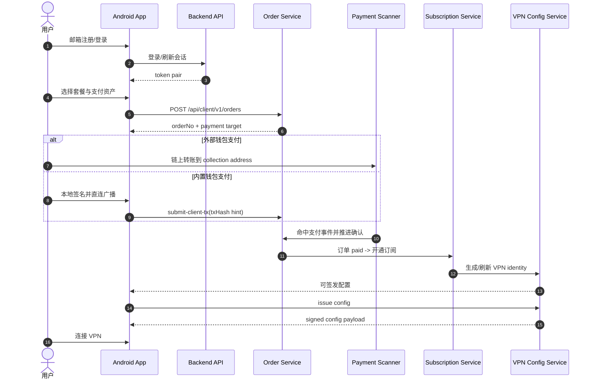
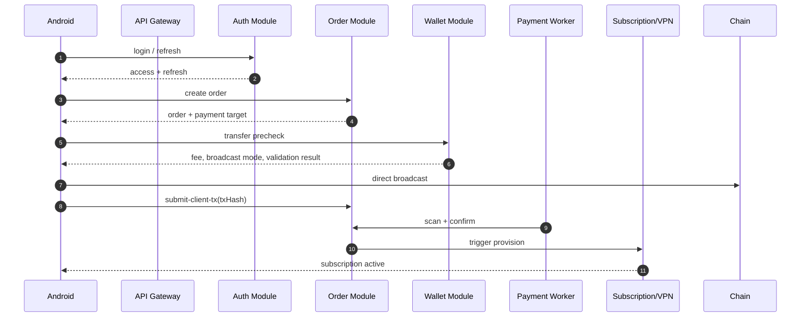
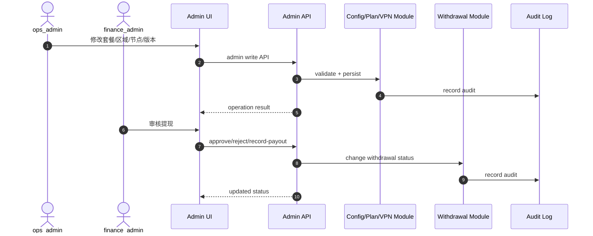
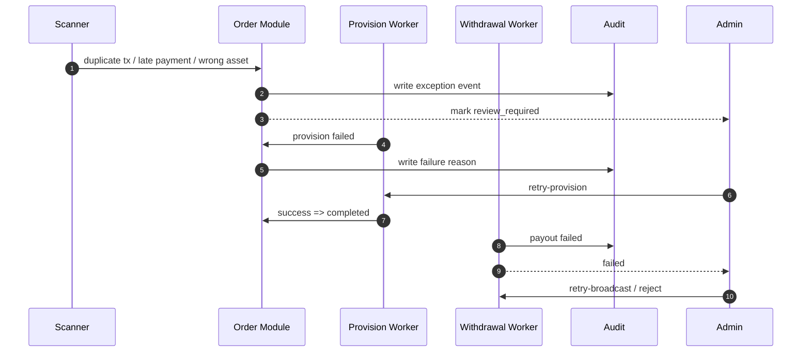

# 06_state_machine_and_business_rules

## 0. 统一规则
1. 状态流转必须由单一服务模块负责推进，不允许多模块并发写同一主状态。
2. 所有 worker 推进都必须幂等；重复触发不能重复开通、重复记账或重复提现。
3. 订单、佣金、提现均以数据库状态为事实源，不以前端显示状态为准。
4. 派生状态（例如 `expiring_soon`）仅存在于页面/UIState，不在数据库落真实状态。
5. 所有非法流转必须返回业务错误码并写结构化日志。

## 1. Account 状态机
| 状态 | 定义 | 进入条件 | 退出条件 | 触发事件 | 非法流转 | 回滚/重试 |
|---|---|---|---|---|---|---|
| PENDING_VERIFY | 邮箱已提交、尚未完成注册确认（仅注册阶段临时） | 请求发送验证码并尚未完成确认 | 注册完成 -> ACTIVE；验证码过期/取消 -> 终止 | register_email | 不可直接进入 FROZEN | 允许重新发送验证码 |
| ACTIVE | 账号可登录、可下单 | 注册成功或后台解冻 | 后台冻结 -> FROZEN；用户关闭 -> CLOSED | register_success / admin_unfreeze | 不可绕过审核直接恢复已关闭账号 | 登录失败不改变状态 |
| FROZEN | 账号冻结 | 后台冻结或风控命中 | 后台解冻 -> ACTIVE | admin_freeze | 冻结状态不可下单/提现/刷新 session | 需后台解除 |
| CLOSED | 账号关闭/注销预留 | 后台关闭 | 无 | admin_close | 不可恢复为 ACTIVE（MVP 不支持） | 无 |
## 2. Session 状态机
| 状态 | 定义 | 进入条件 | 退出条件 | 触发事件 | 非法流转 | 回滚/重试 |
|---|---|---|---|---|---|---|
| ACTIVE | 当前唯一有效 refresh session | 登录成功或 refresh 成功 | 被新登录挤下 -> EVICTED；登出 -> REVOKED；超时 -> EXPIRED；账号冻结 -> REVOKED | login_success / refresh_success | 同账号不可并存多个 ACTIVE | refresh 失败需重新登录 |
| EVICTED | 被新登录替换 | 同账号新 session 建立 | 终态 | new_login_replaces_old | 不可再 refresh 成 ACTIVE | 用户重新登录 |
| REVOKED | 主动撤销 | 登出、后台驱逐、账号冻结 | 终态 | logout / admin_evict | 不可恢复 | 重新登录建立新 session |
| EXPIRED | refresh token 过期 | 超过 ttl | 终态 | ttl_timeout | 不可 refresh | 重新登录 |
## 3. Order 状态机
| 状态 | 定义 | 进入条件 | 退出条件 | 触发事件 | 非法流转 | 回滚/重试 |
|---|---|---|---|---|---|---|
| AWAITING_PAYMENT | 已创建订单，等待付款 | 创建订单成功 | 检测到候选支付 -> PAYMENT_DETECTED；超时 -> EXPIRED；用户取消 -> CANCELED | create_order | 不可直接 COMPLETED | 可重新下单，不复用旧单 |
| PAYMENT_DETECTED | 监听到候选链上事件 | scanner 命中地址/金额 | 确认推进 -> CONFIRMING；异常 -> UNDERPAID_REVIEW/OVERPAID_REVIEW/FAILED | payment_event_matched | 不可绕过确认直接 COMPLETED | scanner 可重复执行但幂等 |
| CONFIRMING | 等待达到链确认阈值 | payment_detected 后满足基础校验 | 满足确认数 -> PAID；解析失败/长时间未确认 -> FAILED | confirm_worker_tick | 不可回到 AWAITING_PAYMENT | 可多次轮询 |
| PAID | 已达到最终确认，待开通 | confirm_worker 达阈值 | 开通任务启动 -> PROVISIONING | confirm_threshold_reached | 不可再次入账 | 幂等推进 |
| PROVISIONING | 订阅开通与 VPN 身份同步中 | paid -> provision | 成功 -> COMPLETED；失败 -> FAILED | provision_worker_start | 不可重复生成多份订阅 | 允许后台 retry-provision |
| COMPLETED | 订单完成且订阅生效 | 开通成功 | 终态 | provision_success | 不可重新开通 | 佣金生成必须幂等 |
| EXPIRED | 超过锁价时间未完成支付 | expire_at reached | 终态（晚付仅生成异常事件，不恢复主状态） | expiry_worker | 不可自动恢复到正常支付流 | 需新订单 |
| UNDERPAID_REVIEW | 少付待人工处理 | 检测金额小于应付 | 人工关闭 / 人工补差策略（MVP 默认人工关闭） | underpaid_detected | 不可自动开通 | 后台人工 |
| OVERPAID_REVIEW | 多付待人工处理 | 检测金额大于应付 | 人工关闭 / 人工退款/补记说明 | overpaid_detected | 不可自动升级套餐 | 后台人工 |
| FAILED | 支付确认或开通失败 | 链解析失败、确认超时、开通失败 | 后台 retry-provision 可进入 PROVISIONING；否则终止 | worker_failure | 不可自动视为完成 | 允许有限重试 |
| CANCELED | 取消/人工关闭 | 后台关闭或用户取消未支付订单 | 终态 | cancel_order | 不可恢复支付 | 重新下单 |
## 4. Payment Event 状态机
| 状态 | 定义 | 进入条件 | 退出条件 | 触发事件 | 非法流转 | 回滚/重试 |
|---|---|---|---|---|---|---|
| DETECTED | 扫描发现候选 tx/event | scanner 命中 | MATCHED / WRONG_ASSET / WRONG_NETWORK / PARSE_FAILED | scanner_hit | 不可直接 CONFIRMED | scanner 可重复命中同 tx 但需幂等 |
| MATCHED | 已匹配到订单目标 | 地址+金额+网络命中 | PENDING_CONFIRMATION / DUPLICATE_TX / LATE_PAYMENT | matcher_success | 不可跳过订单校验 | 可重复匹配同订单，唯一键防重 |
| PENDING_CONFIRMATION | 等待链确认 | matched 成功 | CONFIRMED / FAILED | confirm_worker_tick | 不可回 DETECTED | 可反复轮询 |
| CONFIRMED | 链事件最终确认 | 达到链确认数 | 终态 | confirm_threshold_reached | 不可再次用于其他订单 | 终态 |
| WRONG_ASSET/WRONG_NETWORK/PARSE_FAILED/DUPLICATE_TX/LATE_PAYMENT | 异常事件分类 | 匹配失败或异常 | 终态或人工处理注释 | matcher_failed | 不可推进订单正常完成 | 人工处理 |
## 5. Subscription 状态机
| 状态 | 定义 | 进入条件 | 退出条件 | 触发事件 | 非法流转 | 回滚/重试 |
|---|---|---|---|---|---|---|
| PENDING_ACTIVATION | 支付已确认，等待订阅生效 | 订单 paid | ACTIVE / SUSPENDED / CANCELED | create_subscription | 不可直接 EXPIRED | 允许重试开通 |
| ACTIVE | 订阅生效中 | 开通成功 | EXPIRED / SUSPENDED / CANCELED | provision_success | 不可创建第二个活跃订阅 | 续费更新 expire_at，不新建第二条活跃记录 |
| EXPIRED | 订阅到期 | expire_at reached | ACTIVE（续费后恢复） / CANCELED | subscription_expired | 不可继续签发 VPN 配置 | 续费可恢复 |
| SUSPENDED | 后台暂停/风控暂停 | admin_suspend | ACTIVE / CANCELED | admin_suspend | 暂停时不可签发配置 | 后台恢复 |
| CANCELED | 人工终止 | admin_cancel | 终态 | admin_cancel | 不可恢复 | 需重新购买 |
## 6. Commission 状态机
| 状态 | 定义 | 进入条件 | 退出条件 | 触发事件 | 非法流转 | 回滚/重试 |
|---|---|---|---|---|---|---|
| FROZEN | 订单已完成但仍在冷静期 | 订单 COMPLETED 后生成账本 | AVAILABLE / REVERSED | commission_worker_generate | 冻结态不可提现 | 冷静期任务可幂等释放 |
| AVAILABLE | 可提现 | 冷静期结束 | LOCKED_WITHDRAWAL / REVERSED | cooldown_release | 不可重复释放 | 冲销时进入 REVERSED |
| LOCKED_WITHDRAWAL | 已被提现申请锁定 | 提交提现申请成功 | WITHDRAWN / AVAILABLE / REVERSED | withdraw_request_created | 锁定状态不可重复提现 | 审核拒绝/打款失败可回 AVAILABLE |
| WITHDRAWN | 已完成提现 | 提现完成 | 终态 | withdraw_completed | 不可再释放 | 终态 |
| REVERSED | 冲销 | 订单撤销/作弊/人工冲正 | 终态 | reverse_commission | 不可恢复为 AVAILABLE | 需新账本补正 |
## 7. Withdrawal 状态机
| 状态 | 定义 | 进入条件 | 退出条件 | 触发事件 | 非法流转 | 回滚/重试 |
|---|---|---|---|---|---|---|
| SUBMITTED | 用户已提交申请 | 用户通过前端校验提交 | UNDER_REVIEW / CANCELED | create_withdrawal | 不可直接 COMPLETED | 重复提交靠幂等键控制 |
| UNDER_REVIEW | 待财务审核 | 申请创建成功 | APPROVED / REJECTED | finance_pickup | 无 | 可重复打开查看 |
| APPROVED | 审核通过，待打款 | 财务通过 | BROADCASTING / FAILED | approve_withdrawal | 不可跳过打款直接 COMPLETED | 可进入 retry-broadcast |
| REJECTED | 审核拒绝 | 财务拒绝并写原因 | 终态 | reject_withdrawal | 不可再自动恢复 | 需用户重新提交 |
| BROADCASTING | 正在广播打款交易 | 记录打款开始 | CHAIN_CONFIRMING / FAILED | record_payout | 无 | 可重试广播 |
| CHAIN_CONFIRMING | 链上确认中 | 打款 tx_hash 已记录 | COMPLETED / FAILED | withdraw_confirm_worker | 不可回退到 SUBMITTED | 可多次轮询 |
| COMPLETED | 提现完成 | 链确认达阈值 | 终态 | withdraw_confirmed | 终态 | 无 |
| FAILED | 打款失败 | 广播失败或确认失败 | UNDER_REVIEW / BROADCASTING | withdraw_failed | 无 | 财务可重试或改拒绝 |
| CANCELED | 未处理前取消（MVP 预留） | 系统/人工取消 | 终态 | cancel_withdrawal | 无 | 无 |
## 8. Region / Node / App Version 状态
| 状态 | 定义 | 进入条件 | 退出条件 | 触发事件 | 非法流转 | 回滚/重试 |
|---|---|---|---|---|---|---|
| REGION_ACTIVE / REGION_MAINTENANCE / REGION_DISABLED | 区域可用性 | 后台配置 | 状态变更 | admin_update_region | disabled 区域不可签发 | 可人工恢复 |
| NODE_ACTIVE / NODE_MAINTENANCE / NODE_DISABLED / NODE_OFFLINE | 节点可用性 | 后台配置或健康检测 | 状态变更 | admin_update_node / heartbeat | disabled/offline 节点不可被签发 | 恢复后重新参与调度 |
| VERSION_DRAFT / VERSION_PUBLISHED / VERSION_DEPRECATED | App 版本状态 | 后台创建版本 | publish / deprecate | admin_publish_version | deprecated 不能作为 latest 发布 | 可重新发布更高版本 |

## 9. 关键业务规则
### 9.1 身份与会话
- 一个账号同一时刻仅允许一个 ACTIVE refresh session。
- 新登录成功后旧 session 立即置为 EVICTED。
- 账号被冻结时，所有 ACTIVE session 必须撤销。

### 9.2 订单与支付
- 一个 orderNo 只能对应一个 payment target 快照。
- 一个链上 tx/event 只能匹配到一个主订单处理结论。
- `submit-client-tx` 只是提示，不改变支付事实。
- 少付、多付、错网、错币、晚付一律进入 review，不自动开通。

### 9.3 订阅与 VPN
- 订阅归属账号，不归属钱包地址。
- 一个账号只保留一条当前订阅记录。
- 配置签发要求：账号 active + subscription active + region allowed + node available。
- 节点 disabled/offline 时不得被签发。

### 9.4 钱包
- 私钥和助记词只存在客户端。
- 广播优先 direct；proxy 只接收已签名交易，且仅作兜底。
- 钱包普通交易历史不要求服务端持久化。

### 9.5 分佣与提现
- 佣金只在订单 COMPLETED 后生成。
- 同一来源订单对同一受益人同一层级只能生成一笔账本。
- 提现申请创建时锁定账本与余额；驳回或失败时必须解锁/回滚。
- 默认提现资产与网络固定为 USDT on Solana，除非未来明确扩展。

## 10. Mermaid 时序图
### 10.1 用户端主流程

### 10.2 Android 调用后端主流程

### 10.3 后台配置 / 审核 / 发布流程

### 10.4 异常 / 回滚 / 重试流程

